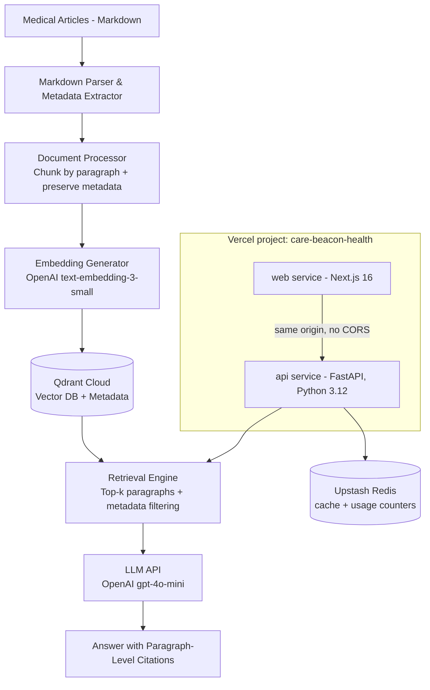

# Care-Beacon Medical RAG Pipeline (Gemini Version)

## Project Overview

A Retrieval-Augmented Generation (RAG) system that processes medical journal articles and answers patient questions with accurate, cited references. The system provides paragraph-level citations to ensure transparency and medical accuracy.

## Current Production State (as of the Vercel migration)

This section is the authoritative description of the live system. Sections below this one describe the original design; where they conflict with this section, this section wins.

- **Live at `https://care-beacon-health.vercel.app`.** One Vercel project (`care-beacon-health`) with two Services defined in `vercel.json`: `web` (Next.js 16, root `web-client/`) and `api` (FastAPI, root `api/`, entrypoint `src.api.main:app`, Python 3.12). They share one domain — `/api/(.*)` routes to the Python service, everything else to Next.js. **There is no CORS layer**; frontend and API are same-origin.
- **Vector DB is Qdrant Cloud**, not Chroma. ChromaDB has been removed entirely from the codebase — there is no `VectorDatabase` class that talks to it. `api/src/storage/qdrant_db.py` is the only vector store implementation; `api/src/storage/vector_db.py` is a thin factory that only ever constructs it.
- **Cache is Upstash Redis** via the Vercel Marketplace, which injects `REDIS_URL` (`rediss://` scheme). Cost and usage counters are stored in a Redis hash, not in process memory — this matters because serverless functions do not share memory between invocations.
- **Render.com, Docker, docker-compose, ngrok and cloudflared are gone.** `render.yaml`, both Dockerfiles, `docker-compose.yml`, and tunnel scripts have all been deleted. Local development runs both services together with `vercel dev`.
- **Rate limiting is a Vercel WAF rule** (`ask-rate-limit`): 60 requests / 60 seconds per IP on `/api/v1/ask`, returning HTTP 429. It is enforced at the platform edge, not in application code.
- **Repository layout**: all Python lives under `api/` (`api/src/`, `api/tests/`, `api/config/`, `api/scripts/ingest.py`). `scraped_data/` and `data/` stay at the repo root, outside `api/`, so the Vercel function bundle excludes them. `.vercelignore` is load-bearing — without it the upload exceeds Vercel's 15,000-file limit.
- **API runtime dependencies are exactly 8** (`api/requirements.txt`): fastapi, pydantic, openai, qdrant-client, redis, pyyaml, loguru, python-dotenv. Everything else (pytest, uvicorn, ragas, black, etc.) is in `api/requirements-dev.txt` and never ships to Vercel.
- **Health check is `GET /api/health`** and performs a real Qdrant collection read, returning 503 if unreachable. `/health` (no `/api` prefix) no longer exists. A daily GitHub Actions workflow (`.github/workflows/keepalive.yml`) pings it so Qdrant's free-tier cluster doesn't get reclaimed for inactivity.
- **Admin endpoints** `POST /api/v1/cache/clear` and `POST /api/v1/stats/reset` require an `X-API-Key` header matching the `ADMIN_API_KEY` environment variable.
- **On-demand ingestion API endpoints were deleted** — they used to spawn a subprocess, which is impossible on serverless. Ingestion is local-only now: `make ingest` runs `api/scripts/ingest.py` against the local machine.
- **Local test command**: `cd api && /opt/anaconda3/envs/care-beacon/bin/python -m pytest tests/ -q --continue-on-collection-errors`. A bare `pytest` resolves to the anaconda base environment and fails — always use the full interpreter path. The local dev environment is Python 3.10.19; Vercel's `api` service runs Python 3.12.
- **The test suite is not fully green, and never has been.** Current baseline: **6 failed, 239 passed, 0 errors**. The 6 failures are pre-existing and unrelated to the migration. Do not claim the suite is green, and do not cite older counts (e.g. "284 tests passing") — they are stale.

## Key Requirements

- **Input**: Pre-parsed markdown medical journal articles
- **Scale**: 100-10,000 articles across general medicine, specific specialties, and patient education
- **Citations**: Paragraph-level granularity with article references
- **Updates**: Real-time ingestion was attempted via API but removed as incompatible with serverless; current ingestion is a local batch/incremental script (`api/scripts/ingest.py`)
- **Vector DB**: Qdrant Cloud (managed, not self-hosted)
- **LLM**: API-based (currently OpenAI `gpt-4o-mini`, see `api/config/config.yaml`)
- **Query Volume**: ~1 query/second (~86,000 queries/day, ~2.6M queries/month)

## Architecture Overview



## Technology Stack Recommendations

### LLM Platform Options (API-Based)

1. **Claude 3.5 Sonnet (Anthropic)** - RECOMMENDED
   - **Pros**:
     - Excellent reasoning and instruction following for citations
     - Large context window (200K tokens) - can fit many retrieved paragraphs
     - Strong medical knowledge and nuanced understanding
     - Good at maintaining factual accuracy (important for medical content)
   - **Cost**: $3/million input tokens, $15/million output tokens
   - **Estimated monthly cost at 1 query/sec**:
     - Assuming ~2K input tokens (10 paragraphs + prompt), ~500 output tokens
     - ~2.6M queries/month × (2K × $3/M + 500 × $15/M) = ~$35,000/month
   - **Best for**: High-accuracy medical answers where citation precision is critical

2. **Claude 3 Haiku (Anthropic)** - COST-EFFECTIVE ALTERNATIVE
   - **Pros**: Much cheaper, still good quality, faster response times
   - **Cost**: $0.25/million input tokens, $1.25/million output tokens
   - **Estimated monthly cost**: ~$2,900/month (same assumptions)
   - **Cons**: Slightly lower reasoning capability than Sonnet
   - **Best for**: Budget-conscious deployment with acceptable accuracy trade-off

3. **GPT-4o (OpenAI)**
   - **Pros**: Strong general knowledge, good API ecosystem, 128K context
   - **Cost**: $2.50/million input tokens, $10/million output tokens
   - **Estimated monthly cost**: ~$26,000/month
   - **Cons**: Smaller context window, can be less reliable with strict citation formatting
   - **Best for**: Teams already invested in OpenAI ecosystem

4. **GPT-4o-mini (OpenAI)** - BUDGET OPTION
   - **Pros**: Very cost-effective, fast, decent quality
   - **Cost**: $0.15/million input tokens, $0.60/million output tokens
   - **Estimated monthly cost**: ~$1,560/month
   - **Cons**: Lower quality for complex medical reasoning
   - **Best for**: Initial testing or less critical queries

**Recommendation**: Start with **Claude 3.5 Sonnet** for quality validation, then test **Claude 3 Haiku** or **GPT-4o-mini** to see if cost savings are worth the trade-off. Consider implementing a hybrid approach where simple queries use cheaper models.

### Vector Database

**Qdrant Cloud (IN USE)** — originally the plan called for self-hosted Chroma; the live system runs Qdrant Cloud instead. ChromaDB has been fully removed from the codebase.
- Managed service — no server to operate ourselves
- Metadata filtering via Qdrant's payload index (`api/src/storage/qdrant_db.py`)
- A daily GitHub Actions keepalive ping (`.github/workflows/keepalive.yml`) prevents the free-tier cluster from being reclaimed for inactivity
- Excellent performance at 10K articles, 1 query/sec

**Performance Considerations at 1 query/sec:**
- Typical query latency: 50-200ms for vector search
- Runs as a Vercel serverless function (`api` service), not a dedicated server
- Redis cache layer (Upstash, via the Vercel Marketplace) reduces repeat LLM calls for frequently asked questions:
  - Cache query results for 24 hours
  - Can reduce LLM API calls substantially for common queries
  - Cost/usage counters live in a Redis hash so they persist across serverless invocations

### Embedding Model

**OpenAI text-embedding-3-small** - RECOMMENDED
- High quality semantic understanding for medical text
- 1536 dimensions, good retrieval performance
- **Cost**: $0.02 per million tokens
- **One-time indexing cost** (10K articles, avg 5K tokens each): ~$1
- **Query cost at 1 query/sec**:
  - Each query needs to embed the question (~50 tokens)
  - ~2.6M queries/month × 50 tokens = 130M tokens = **$2.60/month**
- **Total embedding cost**: Negligible compared to LLM costs

**OpenAI text-embedding-3-large** (higher quality alternative)
- 3072 dimensions, better retrieval accuracy
- **Cost**: $0.13 per million tokens
- **Monthly query cost**: ~$17/month (still negligible)
- Use if retrieval quality is critical

**Cohere embed-english-v3.0** (alternative)
- Optimized for semantic search
- $0.10 per million tokens
- Good for English medical text

**Note**: Avoid self-hosted embedding models at this volume - the cost savings are minimal compared to the operational complexity.

## Implementation Phases

### Phase 1: Foundation (Weeks 1-2)
- [ ] Set up project structure and dependencies
- [ ] Implement markdown parser with metadata extraction
- [ ] Create document preprocessing pipeline
- [x] Build paragraph-level chunking system with section detection
- [x] Set up Qdrant Cloud vector database (superseded the original Chroma plan)
- [x] Implement embedding generation with OpenAI API
- [x] Set up Redis cache for query results (Upstash, via Vercel Marketplace)

### Phase 2: Core RAG (Weeks 3-4)
- [ ] Build retrieval engine with similarity search
- [ ] Implement metadata filtering (by specialty, date, article type)
- [ ] Create citation tracking system
- [ ] Develop LLM integration and prompt templates
- [ ] Build answer generation with citation formatting

### Phase 3: Real-time Ingestion (Week 5)
- [x] ~~Create article ingestion API/pipeline~~ — attempted, then removed: an on-demand ingestion API endpoint spawned a subprocess, which serverless functions cannot do. Ingestion is now a local-only script, `api/scripts/ingest.py`, run via `make ingest`.
- [ ] Implement duplicate detection
- [ ] Add incremental indexing
- [ ] Set up monitoring and logging

### Phase 4: Quality & Safety (Week 6)
- [ ] Implement answer validation
- [ ] Add medical disclaimer system
- [ ] Create relevance scoring
- [ ] Build evaluation framework
- [ ] User testing and refinement

## Key Components

### 1. Markdown Article Parser

```python
# Pseudo-structure
class MedicalArticleParser:
    def parse_markdown(self, markdown_content, metadata=None):
        """Extract structured content from pre-parsed markdown"""
        # Extract from markdown frontmatter or separate metadata file:
        - Article title (from # heading or metadata)
        - Authors (from metadata)
        - Publication date (from metadata)
        - Journal name (from metadata)
        - DOI/URL (from metadata)

        # Parse markdown structure:
        - Identify section headings (##, ###)
        - Extract paragraphs under each section
        - Preserve lists, tables (flatten to text)
        - Handle citations and references

        # Return structured document:
        {
            "metadata": {...},
            "sections": [
                {
                    "name": "Abstract",
                    "paragraphs": ["..."],
                    "level": 2
                },
                {
                    "name": "Introduction",
                    "paragraphs": ["..."],
                    "level": 2
                },
                ...
            ]
        }

    def identify_standard_sections(self, sections):
        """Normalize section names: Abstract, Introduction, Background,
        Methods, Results, Discussion, Conclusion, References"""
        # Handle variations: "Materials and Methods", "Study Design", etc.
```

**Markdown Format Expected:**
```markdown
---
title: "Treatment Approaches for Type 2 Diabetes"
authors: ["Smith, J.", "Doe, A."]
journal: "Journal of Medicine"
publication_date: "2024-03-15"
doi: "10.xxx/xxx"
specialty: "Endocrinology"
article_type: "Research"
---

## Abstract

Diabetes management has evolved significantly...

## Introduction

Type 2 diabetes mellitus affects millions...

## Methods

We conducted a randomized controlled trial...
```

### 2. Document Chunking Strategy

**Paragraph-level chunking** with metadata:
- Each paragraph becomes a chunk
- Preserve section context (which section the paragraph belongs to)
- Add metadata: article_id, paragraph_index, section_name, article_title, authors, journal, date
- Track character positions for precise citation

**Chunk metadata structure:**
```json
{
  "chunk_id": "article123_p5",
  "article_id": "article123",
  "article_title": "Treatment Approaches for Type 2 Diabetes",
  "authors": ["Smith, J.", "Doe, A."],
  "journal": "Medical Journal",
  "publication_date": "2024-03-15",
  "section": "Results",
  "paragraph_index": 5,
  "total_paragraphs": 45,
  "text": "The paragraph content...",
  "url": "https://...",
  "doi": "10.xxx/xxx"
}
```

### 3. Retrieval Strategy

**Hybrid approach:**
1. **Vector similarity search** (semantic matching)
   - Find top-k most relevant paragraphs (k=5-10)
   - Use cosine similarity

2. **Metadata filtering** (optional pre-filtering)
   - Filter by medical specialty if specified
   - Filter by publication date range
   - Filter by article type (research, review, patient education)

3. **Re-ranking** (optional)
   - Reorder by relevance score
   - Diversity to avoid redundant paragraphs from same article

### 4. Citation System

**Citation format for LLM prompt:**
```
[Article: "Treatment Approaches for Type 2 Diabetes", Smith et al., 2024, Medical Journal]
[Section: Results, Paragraph 5]
"The paragraph content..."
```

**Citation format in answer:**
```
The recommended first-line treatment for Type 2 Diabetes is metformin [1].

References:
[1] "Treatment Approaches for Type 2 Diabetes" - Smith, J. et al. (2024)
    Medical Journal, Results section, paragraph 5
    DOI: 10.xxx/xxx
```

### 5. LLM Prompt Template

```
You are a medical information assistant. Answer the patient's question using ONLY the provided medical journal excerpts. You must:

1. Provide accurate, clear answers appropriate for patients
2. Cite specific paragraphs using [1], [2], etc.
3. If the excerpts don't contain enough information to answer confidently, say so
4. Add appropriate medical disclaimers
5. Use accessible language while maintaining medical accuracy

RETRIEVED EXCERPTS:
{retrieved_paragraphs_with_metadata}

PATIENT QUESTION:
{user_question}

REQUIREMENTS:
- Only use information from the excerpts above
- Cite every claim with [number] references
- List all references at the end with full article details and paragraph numbers
- If information is insufficient or unclear, state this explicitly
- Include disclaimer: "This information is for educational purposes only. Please consult with a healthcare provider for medical advice."

ANSWER:
```

### 6. Ingestion Pipeline

**This was originally designed as an API-triggered "real-time" pipeline (`Phase 3` above). That design was implemented and then removed**: the ingestion API endpoints spawned a subprocess to run the pipeline, which is not possible on Vercel's serverless functions. Ingestion today is local-only, run by hand via `make ingest` (`api/scripts/ingest.py`) against a Qdrant Cloud collection. The pseudocode below still describes the pipeline's internal steps; only the trigger (API call vs. local script) has changed.

```python
# Pseudo-structure
class ArticleIngestionPipeline:
    def ingest_article(self, markdown_file_path):
        """Process a new article"""
        1. Read markdown file
        2. Parse markdown → structured article with metadata
        3. Check for duplicates (by DOI, title hash)
        4. Chunk into paragraphs with section context
        5. Generate embeddings (batch API calls for efficiency)
        6. Store chunks in Qdrant with metadata
        7. Invalidate related cache entries
        8. Log ingestion event

    def update_article(self, article_id):
        """Update existing article"""
        1. Query Qdrant for all chunks with article_id
        2. Delete old chunks
        3. Re-process markdown file
        4. Re-index with new chunks
        5. Clear cache entries for this article

    def batch_ingest(self, markdown_directory):
        """Initial bulk ingestion of article corpus"""
        1. Scan directory for all .md files
        2. Process in parallel (10-20 threads)
        3. Batch embedding generation (100 chunks at a time)
        4. Bulk insert into Qdrant
        5. Progress tracking and error handling
```

## Safety and Compliance Considerations

### Medical Accuracy
- **Source verification**: Only ingest from reputable medical journals
- **Date awareness**: Include publication dates in citations for medical currency
- **Confidence thresholds**: Don't answer if confidence is below threshold
- **Contradiction detection**: Flag if retrieved paragraphs contradict each other

### Disclaimers
Always include:
- "This information is for educational purposes only"
- "Not a substitute for professional medical advice"
- "Consult healthcare provider for diagnosis and treatment"

### Privacy
- No storage of patient-specific information in queries
- Anonymize logs if storing for improvement
- HIPAA compliance if handling any protected health information

### Quality Control
- Regular audits of answers for accuracy
- Feedback mechanism for incorrect information
- Version tracking of article corpus
- Monitor for hallucinations (claims not in source material)

## Evaluation and Testing

### Metrics to Track

1. **Retrieval Quality**
   - Precision@k: Are retrieved paragraphs relevant?
   - Recall: Are all relevant paragraphs retrieved?
   - MRR (Mean Reciprocal Rank): Position of first relevant result

2. **Answer Quality**
   - Citation accuracy: Are all claims cited?
   - Faithfulness: Does answer match source content?
   - Completeness: Does answer address the question?
   - Clarity: Is answer understandable to patients?

3. **System Performance**
   - Query latency (target: < 5 seconds)
   - Ingestion speed (articles per minute)
   - Vector DB size and query performance

### Test Set Creation
- Curate 50-100 common patient questions across medical domains
- Have medical professionals create ground truth answers with citations
- Evaluate system outputs against ground truth
- Iterate on prompts and retrieval parameters

## Project Structure

This is the actual layout of the live repository — a Vercel monorepo with two Services (`vercel.json`). It supersedes the original single-`src/` design below it in spirit; the module breakdown (ingestion, embeddings, storage, retrieval, generation) survived, but everything Python now lives under `api/`, and `web-client/` is a separate Next.js service.

```
care-beacon/
├── api/                                # Vercel "api" service (FastAPI, Python 3.12)
│   ├── src/
│   │   ├── api/
│   │   │   ├── main.py                 # FastAPI app: routes, health check, admin auth
│   │   │   └── models.py               # Pydantic request/response models
│   │   ├── ingestion/
│   │   │   └── markdown_parser.py      # Parse markdown with frontmatter
│   │   ├── embeddings/
│   │   │   ├── embedding_generator.py  # OpenAI embeddings API wrapper
│   │   │   └── chunking.py             # Paragraph-level chunking logic
│   │   ├── storage/
│   │   │   ├── vector_db.py            # Factory that constructs the Qdrant client
│   │   │   ├── qdrant_db.py            # Qdrant Cloud implementation (the only one)
│   │   │   └── models.py               # Data models for chunks, retrieval results
│   │   ├── retrieval/
│   │   │   ├── retrieval_engine.py     # Vector search + metadata filtering
│   │   │   └── reranker.py             # Re-ranking logic
│   │   ├── caching/
│   │   │   ├── redis_cache.py          # Upstash Redis cache wrapper
│   │   │   └── stats_store.py          # Cost/usage counters, stored in a Redis hash
│   │   ├── generation/
│   │   │   ├── llm_client.py           # OpenAI client (gpt-4o-mini)
│   │   │   └── answer_generator.py     # Orchestrates retrieval + generation + citations
│   │   └── config_loader.py
│   ├── tests/                          # pytest suite
│   ├── config/
│   │   ├── config.yaml                 # System configuration
│   │   └── prompts*.yaml               # LLM prompt templates
│   ├── scripts/
│   │   └── ingest.py                   # Local-only ingestion entrypoint (`make ingest`)
│   ├── requirements.txt                # Exactly 8 runtime deps shipped to Vercel
│   └── requirements-dev.txt            # pytest, uvicorn, black, ragas, etc. — dev only
├── web-client/                         # Vercel "web" service (Next.js 16)
│   ├── app/
│   ├── components/
│   └── lib/
├── scraped_data/                       # Source corpus. Repo root, NOT under api/ —
│                                       # excluded from the function bundle via .vercelignore
├── data/                                # Generated artifacts. Also repo root, also excluded
├── evaluation/                          # RAG evaluation scripts and sample question sets
├── docs/                                # This project's documentation (see docs/ARCHITECTURE.md)
├── .github/workflows/keepalive.yml     # Daily ping to /api/health to keep Qdrant alive
├── vercel.json                          # Defines the two Services and routing rules
├── .vercelignore                        # Load-bearing: keeps upload under 15,000 files
├── Makefile
├── README.md
└── Gemini.md / CLAUDE.md (this file)
```

## Next Steps

1. ✅ **LLM Platform**: API-based, OpenAI `gpt-4o-mini` (see `api/config/config.yaml`)
2. ✅ **Input Format**: Parsed markdown articles
3. ✅ **Query Volume**: 1 query/second (~86K/day)
4. ✅ **Vector DB**: Qdrant Cloud (managed, not self-hosted — supersedes the original Chroma plan)
5. ✅ **Deployment environment**: Vercel — one project, two Services (`web` + `api`), see "Current Production State" above
6. ✅ **Set up development environment**: `vercel dev` runs both services; Python 3.10.19 locally, 3.12 on Vercel
7. ✅ **Add caching layer**: Upstash Redis via the Vercel Marketplace
8. ✅ **Production hardening**: rate limiting via a Vercel WAF rule, admin endpoints behind `X-API-Key`, `/api/health` checked daily by GitHub Actions
9. **Open**: Evaluate quality — `evaluation/` has a RAG evaluation harness (ragas); no evidence in this repo of a completed evaluation run
10. **Open**: Initial/ongoing data ingestion volume and cadence beyond `make ingest`

## Questions to Address Before Production

- [x] LLM platform choice (API-based) — OpenAI `gpt-4o-mini`
- [x] Input format (markdown)
- [x] Query volume (1 query/sec)
- [x] **Deployment environment** — Vercel, not AWS/GCP/Azure/on-premises
- [ ] **Budget for LLM API costs**: not documented in this repo
- [ ] **End users**: Patients directly, or medical staff answering patient questions?
- [ ] **Medical specialties to prioritize first**: Which specialties in your markdown corpus?
- [ ] **Medical review process**: How will answers be validated before going to patients?
- [ ] **Legal/compliance**: HIPAA requirements? Medical disclaimers? Jurisdiction-specific rules?
- [ ] **Monitoring and observability**: Beyond the daily `/api/health` keepalive ping, what else is needed?

## Cost Summary

The dollar figures below are from the original pre-implementation planning phase and describe **hypothetical self-hosted infrastructure that was never built** (a dedicated server running Chroma + Redis). They do not reflect actual Vercel, Qdrant Cloud, or Upstash Redis billing, which this repository has no record of. They're kept only as the original LLM-choice cost comparison; treat the "Infrastructure" line in each option as void.

### Option 1: Claude 3.5 Sonnet (Premium Quality)
- **LLM API**: ~$35,000/month
- **Embeddings**: ~$3/month
- **Total**: not applicable — actual system uses `gpt-4o-mini`, not Claude

### Option 2: Claude 3 Haiku (Balanced)
- **LLM API**: ~$2,900/month
- **Embeddings**: ~$3/month
- **Total**: not applicable — actual system uses `gpt-4o-mini`, not Claude

### Option 3: GPT-4o-mini (Budget) — THE OPTION ACTUALLY IN USE
- **LLM API**: ~$1,560/month (original estimate; not verified against actual usage)
- **Embeddings**: ~$3/month
- **Infrastructure**: actual cost unknown — this repo has no record of Vercel/Qdrant Cloud/Upstash billing

**Note**: `gpt-4o-mini` was chosen, matching the original budget recommendation. The infrastructure cost figures above predate the decision to use Vercel + Qdrant Cloud + Upstash Redis and should not be cited as current.

---

**Document Version**: 3.0 — updated for the Vercel migration; see "Current Production State" near the top of this file.
**Last Updated**: 2026-08-05
**Project Owner**: Care-Beacon Team
