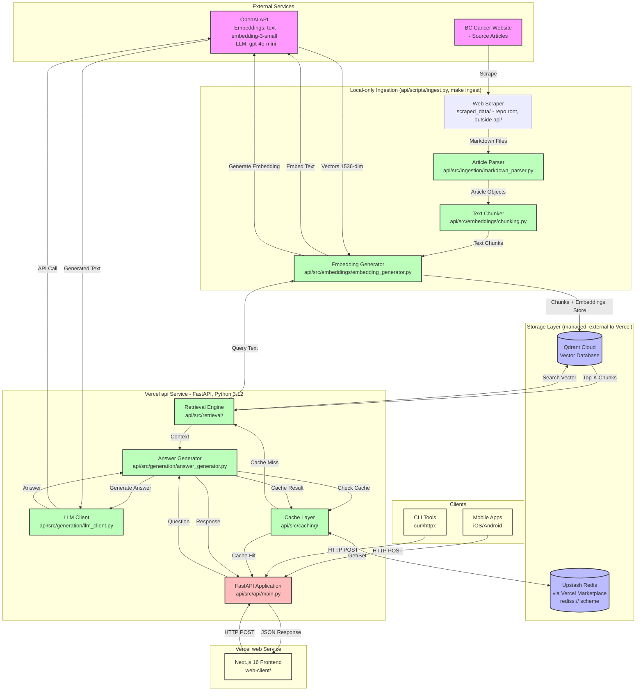
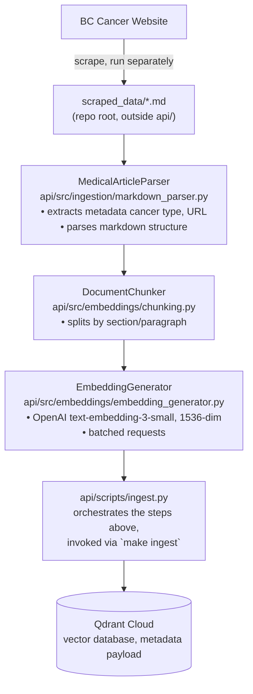
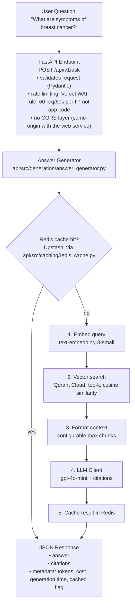
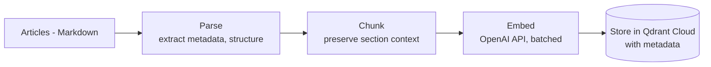
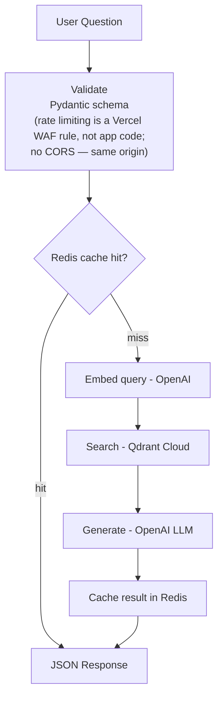
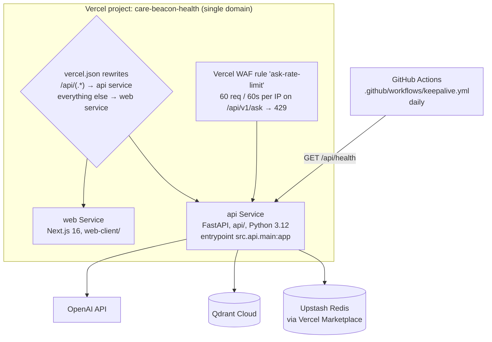

# Care-Beacon System Architecture

## System Overview

Care-Beacon is a Retrieval-Augmented Generation (RAG) system that provides AI-powered answers to medical questions about cancer, backed by BC Cancer's educational materials.

**Live at `https://care-beacon-health.vercel.app`** — a single Vercel project (`care-beacon-health`) with two Services declared in `vercel.json`: `web` (Next.js 16, `web-client/`) and `api` (FastAPI, `api/`, entrypoint `src.api.main:app`, Python 3.12). Both share one domain; `/api/(.*)` routes to the Python service, everything else to Next.js. There is no CORS layer — the two services are same-origin.

## High-Level Architecture Diagram



## Detailed Component Architecture

### 1. Ingestion Pipeline (local-only, `make ingest`)

Ingestion never runs on Vercel — there used to be an on-demand ingestion API endpoint, but it spawned a subprocess, which serverless functions cannot do, so it was deleted. The only way to (re)index content now is to run `api/scripts/ingest.py` on a local machine.



### 2. RAG Query Pipeline



No specific latency, cost-per-query, or cache-hit-rate numbers are recorded in this repository for the live Vercel deployment — historical figures that appeared here previously were not re-verified after the migration and have been removed rather than repeated as fact.

## Technology Stack

### Core Technologies

- **Language & Runtime**
  - Local dev: Python 3.10.19 (conda environment `care-beacon`)
  - Vercel `api` service: Python 3.12 — the two environments differ deliberately; see `docs/DEVELOPER_GUIDE.md`
- **Web Framework** (`api/requirements.txt`)
  - FastAPI 0.115.0 (REST API)
  - Uvicorn — dev-only, for local `vercel dev` / manual runs (`api/requirements-dev.txt`)
  - Pydantic >= 2.9.0 (data validation)
  - No CORS middleware — the `api` and `web` Vercel Services share one origin
- **Vector Database**
  - Qdrant Cloud (managed), via `qdrant-client==1.12.1`
  - Cosine similarity search, payload-based metadata filtering
  - ChromaDB has been fully removed from this codebase
- **Cache Layer**
  - Upstash Redis, provisioned through the Vercel Marketplace (`REDIS_URL`, `rediss://` scheme) — not a self-hosted container
  - `redis==5.0.1` Python client
  - Cost/usage counters stored in a Redis hash (`api/src/caching/stats_store.py`) so they survive across serverless invocations
- **AI/ML Services**
  - OpenAI API for both embeddings and generation
  - `text-embedding-3-small` (1536-dim)
  - `gpt-4o-mini` (generation) — see `api/config/config.yaml`
  - `openai>=1.109.1`
- **Configuration & Utilities**
  - PyYAML (config files)
  - python-dotenv (`.env` management)
  - loguru (logging)
  - python-frontmatter — dev/ingestion-only, not a runtime dependency of the deployed API
- **Testing** (`api/requirements-dev.txt`, never shipped to Vercel)
  - pytest 8.0.0, pytest-asyncio, pytest-cov, httpx
  - Run with `cd api && /opt/anaconda3/envs/care-beacon/bin/python -m pytest tests/ -q --continue-on-collection-errors` — current baseline is 6 failed, 239 passed, 0 errors
- **Deployment**
  - Vercel: one project (`care-beacon-health`), two Services (`web`, `api`) defined in `vercel.json`
  - No Docker, no docker-compose, no Render.com — all deleted as part of the migration
  - Rate limiting via a Vercel WAF rule, not application middleware

## Data Flow Diagrams

These are condensed restatements of the two diagrams in "Detailed Component Architecture" above — see there for module-level detail.

### Ingestion Flow (local-only, `make ingest`)



Actual chunk counts and one-time embedding cost are not recorded in this repository and are not repeated here.

### Query Flow (Runtime, `POST /api/v1/ask`)



Specific per-query latency and cost numbers are not recorded in this repository for the live deployment and are not repeated here.

## File Structure & Organization

This reflects the actual repository layout: a Vercel monorepo, defined by `vercel.json`, with all Python isolated under `api/` so `.vercelignore` can exclude everything else from the function bundle.

```
Care-Beacon/
│
├── vercel.json               # Defines the `web` and `api` Services + routing
├── .vercelignore             # Load-bearing: keeps the upload under Vercel's 15,000-file limit
│
├── api/                       # Vercel "api" Service (FastAPI, Python 3.12)
│   ├── src/
│   │   ├── ingestion/
│   │   │   └── markdown_parser.py      # MedicalArticleParser: markdown → Article objects
│   │   ├── embeddings/
│   │   │   ├── chunking.py             # DocumentChunker
│   │   │   └── embedding_generator.py  # OpenAI embeddings wrapper
│   │   ├── storage/
│   │   │   ├── models.py               # Chunk, RetrievalResult, etc.
│   │   │   ├── vector_db.py            # Factory — always constructs a Qdrant client
│   │   │   └── qdrant_db.py            # QdrantVectorDatabase (the only implementation)
│   │   ├── retrieval/
│   │   │   ├── models.py
│   │   │   ├── retrieval_engine.py     # Vector search + metadata filtering
│   │   │   └── reranker.py
│   │   ├── generation/
│   │   │   ├── models.py               # GeneratedAnswer, Citation
│   │   │   ├── llm_client.py           # OpenAI LLM wrapper
│   │   │   └── answer_generator.py     # RAG coordinator
│   │   ├── caching/
│   │   │   ├── models.py
│   │   │   ├── redis_cache.py          # Upstash Redis client wrapper
│   │   │   └── stats_store.py          # Cost/usage counters, stored in a Redis hash
│   │   ├── api/
│   │   │   ├── models.py               # Pydantic request/response models
│   │   │   └── main.py                 # FastAPI app, routes, health check, admin auth
│   │   └── config_loader.py
│   ├── scripts/
│   │   └── ingest.py          # Local-only ingestion entrypoint (`make ingest`)
│   ├── config/
│   │   ├── config.yaml
│   │   └── prompts*.yaml
│   ├── tests/                 # pytest suite — see docs/TESTING.md for current pass/fail counts
│   ├── requirements.txt       # Exactly 8 runtime deps shipped to Vercel
│   └── requirements-dev.txt   # pytest, uvicorn, black, ragas, etc. — dev only
│
├── web-client/                 # Vercel "web" Service (Next.js 16)
│
├── scraped_data/               # Source corpus — repo root, NOT under api/, excluded via .vercelignore
├── data/                       # Generated artifacts — also repo root, also excluded
│
├── evaluation/                 # RAG evaluation harness (ragas), sample question sets
├── docs/                       # This documentation
├── .github/workflows/keepalive.yml  # Daily ping to /api/health
├── Makefile
└── README.md
```

Current test count for `api/tests/`: **6 failed, 239 passed, 0 errors** (see `docs/TESTING.md`) — not "all passing," and not the older test counts that appear in some historical docs under `docs/CHECKPOINT_*.md`.

## Deployment Architecture

Docker, docker-compose, Render.com, ngrok and cloudflared have all been removed from this repository. There is no multi-instance load-balancer setup, no Redis cluster, and no separately-managed vector DB volume to operate — Vercel, Qdrant Cloud, and Upstash Redis are all managed services.

### Actual Production Setup (Vercel)



There is no CORS layer (same origin), no load balancer to configure, and no container images to build.

## Performance Characteristics

### Throughput & Latency

The specific latency, throughput and cache-hit-rate figures that used to live in this section (e.g. "~2,500ms first query," "40-60% hit rate," "HNSW index ~25MB") described the earlier self-hosted Chroma/SQLite setup and were never re-measured against the live Qdrant Cloud + Vercel deployment. Rather than repeat unverified numbers, note what's actually enforced:

- Rate limiting is a Vercel WAF rule capping `/api/v1/ask` at 60 requests / 60 seconds per IP (HTTP 429 beyond that) — not an application-level throughput figure.
- Caching is Upstash Redis; see `docs/PERFORMANCE_OPTIMIZATION.md` for how the cache and cost/usage counters work.
- Qdrant Cloud is a managed service; there is no local index-size or SQLite-concurrency characteristic to report anymore.

### Cost Analysis

The detailed per-query and monthly cost tables that used to appear here assumed self-hosted infrastructure (a dedicated server, a fixed Redis hosting fee) that was never built. This repository has no record of actual Vercel, Qdrant Cloud, or Upstash Redis billing, so no cost breakdown is given here rather than repeating stale estimates. OpenAI's published per-token pricing for `text-embedding-3-small` and `gpt-4o-mini` still applies to the embedding and generation calls themselves; everything downstream of that (hosting, vector DB, cache) is now billed by Vercel/Qdrant/Upstash directly rather than estimated here.

## Scalability & Reliability

### Scaling on Vercel

The old "horizontal scaling strategy" here assumed self-managed infrastructure — running multiple FastAPI instances behind a load balancer, sharding Redis, ChromaDB read replicas. None of that applies anymore:

- **API layer**: the `api` Service is a Vercel serverless function. Vercel scales invocations automatically; there are no instances to provision, and no load balancer to configure.
- **Cache layer**: Upstash Redis (Vercel Marketplace) is a managed service; sharding/HA are Upstash's concern, not this codebase's.
- **Vector database**: Qdrant Cloud is a managed service. There is no "ChromaDB on single disk" concern anymore, and no local index to shard.
- **Real constraint to watch**: OpenAI API rate limits still apply regardless of hosting — this hasn't changed.
- **Real constraint to watch**: Qdrant Cloud's free tier reclaims idle clusters; the daily `keepalive.yml` GitHub Actions ping exists specifically to prevent that.

### Failure Modes & Recovery

- **Redis (Upstash) unavailable**: cache lookups miss; the request path continues to Qdrant + OpenAI. `api/src/caching/redis_cache.py` is the place to check for how failures are handled — this doc does not restate unverified fallback behavior.
- **Qdrant Cloud unavailable**: `/api/health` performs a real collection read and returns 503 when it can't reach Qdrant, which is exactly the signal the keepalive workflow watches for. A query-time failure here means the request cannot retrieve context.
- **OpenAI API failure**: affects both embeddings (query-time) and generation. There is no documented secondary LLM provider in this codebase — `gpt-4o-mini` via OpenAI is the only configured option (`api/config/config.yaml`).
- **`api` Service failure**: Vercel handles function-level restarts; there is no separate load balancer or "instance" concept to reason about here.

## Monitoring & Observability

```
┌─────────────────────────────────────────────────────────────────┐
│                  MONITORING STRATEGY                             │
├─────────────────────────────────────────────────────────────────┤
│                                                                  │
│  Application Metrics (Built-in)                                │
│  ├─ GET /api/health  (NOT /health -- that path no longer exists)│
│  │  ├─ Real Qdrant collection read; 503 if unreachable          │
│  │  ├─ Pinged daily by .github/workflows/keepalive.yml          │
│  │  └─ Service status (vector_db, redis) + version info         │
│  │                                                              │
│  └─ GET /api/v1/stats                                          │
│     ├─ LLM usage (calls, tokens, cost)                         │
│     ├─ Cache performance (hit rate, savings)                   │
│     └─ Retrieval stats (embeddings cost)                       │
│                                                                  │
│  Key Metrics to Track                                          │
│  ├─ Latency:                                                    │
│  │  ├─ P50, P95, P99 response times                           │
│  │  ├─ Cache hit latency vs miss                              │
│  │  └─ OpenAI API latency                                     │
│  │                                                              │
│  ├─ Throughput:                                                │
│  │  ├─ Requests per second                                    │
│  │  ├─ Success rate (2xx responses)                           │
│  │  └─ Error rate (4xx, 5xx)                                  │
│  │                                                              │
│  ├─ Costs:                                                     │
│  │  ├─ OpenAI API spend                                       │
│  │  ├─ Cost per query                                         │
│  │  └─ Cache savings                                          │
│  │                                                              │
│  ├─ Cache:                                                     │
│  │  ├─ Hit rate (target: >40%)                                │
│  │  ├─ Memory usage                                           │
│  │  └─ Eviction rate                                          │
│  │                                                              │
│  └─ Resources:                                                 │
│     ├─ CPU usage                                               │
│     ├─ Memory usage                                            │
│     └─ Disk I/O                                                │
│                                                                  │
│  Recommended Tools                                              │
│  ├─ Prometheus + Grafana (metrics)                             │
│  ├─ DataDog / New Relic (APM)                                  │
│  ├─ CloudWatch / Stackdriver (cloud-native)                    │
│  └─ Sentry (error tracking)                                    │
│                                                                  │
└─────────────────────────────────────────────────────────────────┘
```

---

## Maintenance & Operations

### Regular Tasks

```
Daily:
├─ Monitor cache hit rate (should be >40%)
├─ Check error logs
├─ Review API costs
└─ Verify all services healthy

Weekly:
├─ Review slow queries
├─ Check Redis memory usage
├─ Analyze popular questions
└─ Update cost projections

Monthly:
├─ Review and optimize prompts
├─ Update medical content (re-ingest)
├─ Security patches
└─ Performance tuning

Quarterly:
├─ Evaluate new LLM models
├─ Consider vector DB alternatives
├─ Capacity planning
└─ Cost optimization review
```

### Update Procedures

```
Content Updates (New Articles):
1. Add new markdown files to scraped_data/ (repo root, outside api/)
2. Run: make ingest   (runs `cd api && python scripts/ingest.py` locally --
   this never runs on Vercel; the old on-demand ingestion API was removed)
3. Verify: check the Qdrant Cloud collection directly, or GET /api/v1/vector-db/stats

Code Deployments:
1. Run tests: cd api && /opt/anaconda3/envs/care-beacon/bin/python -m pytest tests/ -q
   --continue-on-collection-errors  (bare `pytest` resolves to the wrong interpreter)
2. Push / deploy via Vercel (no Docker image to build)
3. Monitor: GET /api/health
4. Rollback: use Vercel's deployment rollback, not a kept container image

Configuration Changes:
1. Update api/config/config.yaml
2. Test locally first (`vercel dev`)
3. Deploy via Vercel
4. Monitor impact on metrics
```

---

**Last Updated**: 2026-08-05
**Status**: Live in production at https://care-beacon-health.vercel.app
