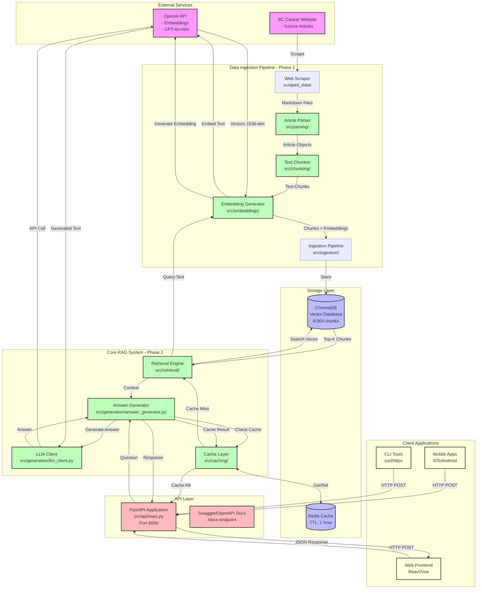

# Care-Beacon System Architecture

## System Overview

Care-Beacon is a Retrieval-Augmented Generation (RAG) system that provides AI-powered answers to medical questions about cancer, backed by BC Cancer's educational materials.

## High-Level Architecture Diagram



## Detailed Component Architecture

### 1. Data Ingestion Pipeline (Phase 1)

```
┌─────────────────────────────────────────────────────────────────┐
│                    DATA INGESTION PIPELINE                       │
├─────────────────────────────────────────────────────────────────┤
│                                                                  │
│  BC Cancer Website                                              │
│         │                                                        │
│         ▼                                                        │
│  ┌──────────────┐                                               │
│  │ Web Scraper  │  scraped_data/*.md                           │
│  └──────┬───────┘                                               │
│         │                                                        │
│         ▼                                                        │
│  ┌──────────────┐                                               │
│  │    Parser    │  src/parsing/parser.py                       │
│  │              │  • Extracts metadata (cancer type, URL)       │
│  │              │  • Parses markdown structure                  │
│  │              │  • Creates Article objects                    │
│  └──────┬───────┘                                               │
│         │                                                        │
│         ▼                                                        │
│  ┌──────────────┐                                               │
│  │   Chunker    │  src/chunking/chunker.py                     │
│  │              │  • Splits by sections/paragraphs             │
│  │              │  • Max 500 tokens per chunk                  │
│  │              │  • Preserves metadata & context              │
│  └──────┬───────┘                                               │
│         │                                                        │
│         ▼                                                        │
│  ┌──────────────┐                                               │
│  │  Embedding   │  src/embeddings/generator.py                 │
│  │  Generator   │  • OpenAI text-embedding-3-small             │
│  │              │  • 1536 dimensions                           │
│  │              │  • Batch processing (100 chunks)             │
│  └──────┬───────┘                                               │
│         │                                                        │
│         ▼                                                        │
│  ┌──────────────┐                                               │
│  │  Ingestion   │  src/ingestion/ingester.py                   │
│  │   Pipeline   │  • Coordinates all steps                     │
│  │              │  • Tracks progress (4,064 chunks)            │
│  │              │  • Stores in ChromaDB                        │
│  └──────┬───────┘                                               │
│         │                                                        │
│         ▼                                                        │
│  ┌──────────────────────────────────────┐                      │
│  │      ChromaDB Vector Database         │                      │
│  │  • Collection: care-beacon-medical    │                      │
│  │  • 4,064 chunks with embeddings       │                      │
│  │  • Metadata: cancer_type, URL, etc.   │                      │
│  └───────────────────────────────────────┘                      │
│                                                                  │
└─────────────────────────────────────────────────────────────────┘

Stats: 94 articles → 4,064 chunks → $0.005 total cost
```

### 2. RAG Query Pipeline (Phase 2)

```
┌─────────────────────────────────────────────────────────────────┐
│                      RAG QUERY PIPELINE                          │
├─────────────────────────────────────────────────────────────────┤
│                                                                  │
│  User Question: "What are symptoms of breast cancer?"          │
│         │                                                        │
│         ▼                                                        │
│  ┌──────────────────────────────────────┐                      │
│  │         FastAPI Endpoint             │                      │
│  │     POST /api/v1/ask                │                      │
│  │  • Validates request (Pydantic)      │                      │
│  │  • Rate limiting (60/min)            │                      │
│  │  • CORS headers                      │                      │
│  └──────────┬───────────────────────────┘                      │
│             │                                                    │
│             ▼                                                    │
│  ┌──────────────────────────────────────┐                      │
│  │      Answer Generator                │                      │
│  │  src/generation/answer_generator.py  │                      │
│  └──────────┬───────────────────────────┘                      │
│             │                                                    │
│             ├──────────────────────────────────┐               │
│             │                                   │               │
│             ▼                                   ▼               │
│  ┌──────────────────┐              ┌──────────────────┐       │
│  │  Redis Cache     │              │ Cache Miss Path  │       │
│  │  CHECK           │              │                  │       │
│  │                  │              │  Retrieval       │       │
│  │  Cache Hit? ─────┼──YES────────▶│  Engine         │       │
│  │    50% hit rate  │              │                  │       │
│  └──────────────────┘              └────────┬─────────┘       │
│             │                                │                 │
│             │ NO                             ▼                 │
│             │                      ┌──────────────────┐       │
│             │                      │  1. Embed Query  │       │
│             │                      │  text-embedding  │       │
│             │                      │  -3-small        │       │
│             │                      └────────┬─────────┘       │
│             │                               │                 │
│             │                               ▼                 │
│             │                      ┌──────────────────┐       │
│             │                      │ 2. Vector Search │       │
│             │                      │ ChromaDB         │       │
│             │                      │ Top-K chunks     │       │
│             │                      │ Cosine similarity│       │
│             │                      └────────┬─────────┘       │
│             │                               │                 │
│             │                               ▼                 │
│             │                      ┌──────────────────┐       │
│             │                      │ 3. Format Context│       │
│             │                      │ 5 chunks max     │       │
│             │                      └────────┬─────────┘       │
│             │                               │                 │
│             │                               ▼                 │
│             │                      ┌──────────────────┐       │
│             │                      │ 4. LLM Client    │       │
│             │                      │ GPT-4o-mini      │       │
│             │                      │ + Citations      │       │
│             │                      └────────┬─────────┘       │
│             │                               │                 │
│             │                               ▼                 │
│             │                      ┌──────────────────┐       │
│             │                      │ 5. Cache Result  │       │
│             │                      │ TTL: 1 hour      │       │
│             │                      └────────┬─────────┘       │
│             │                               │                 │
│             └───────────────────────────────┘                 │
│                             │                                  │
│                             ▼                                  │
│                  ┌──────────────────┐                         │
│                  │  JSON Response   │                         │
│                  │  • Answer        │                         │
│                  │  • Citations     │                         │
│                  │  • Metadata      │                         │
│                  │  • Cost: $0.0001 │                         │
│                  │  • Time: <10ms   │                         │
│                  │    (if cached)   │                         │
│                  └──────────────────┘                         │
│                                                                │
└────────────────────────────────────────────────────────────────┘

Performance:
- First query: ~2,500ms, $0.0002
- Cached query: <10ms, ~$0.0000 (50% of queries)
```

## Technology Stack

### Core Technologies

```
┌─────────────────────────────────────────────────────────────────┐
│                      TECHNOLOGY STACK                            │
├─────────────────────────────────────────────────────────────────┤
│                                                                  │
│  Language & Runtime                                             │
│  ├─ Python 3.10.19 (specific version for ChromaDB compat)      │
│  └─ Conda environment: care-beacon                              │
│                                                                  │
│  Web Framework                                                  │
│  ├─ FastAPI 0.109.2 (REST API)                                 │
│  ├─ Uvicorn (ASGI server)                                      │
│  ├─ Pydantic 2.6.1 (data validation)                           │
│  └─ CORS middleware                                             │
│                                                                  │
│  Vector Database                                                │
│  ├─ ChromaDB 0.4.22 (persistent storage)                       │
│  ├─ HNSW indexing                                              │
│  ├─ Cosine similarity search                                   │
│  └─ Metadata filtering                                         │
│                                                                  │
│  Cache Layer                                                    │
│  ├─ Redis 7 (docker container)                                 │
│  ├─ Python redis 5.0.1 client                                  │
│  ├─ TTL-based expiration                                       │
│  └─ SHA-256 key hashing                                        │
│                                                                  │
│  AI/ML Services                                                 │
│  ├─ OpenAI API (embeddings + LLM)                             │
│  ├─ text-embedding-3-small (1536-dim)                         │
│  ├─ GPT-4o-mini (generation)                                   │
│  └─ openai==1.12.0                                             │
│                                                                  │
│  Configuration & Utilities                                      │
│  ├─ PyYAML (config files)                                      │
│  ├─ python-dotenv (.env management)                            │
│  ├─ python-frontmatter (markdown parsing)                      │
│  └─ loguru (logging)                                           │
│                                                                  │
│  Testing                                                        │
│  ├─ pytest 8.0.0                                               │
│  ├─ pytest-asyncio (async tests)                              │
│  ├─ httpx (API testing)                                        │
│  └─ unittest.mock (mocking)                                    │
│                                                                  │
│  Deployment                                                     │
│  ├─ Docker & docker-compose                                    │
│  ├─ Redis container (redis:7-alpine)                          │
│  └─ Optional: PostgreSQL with pgvector                         │
│                                                                  │
└─────────────────────────────────────────────────────────────────┘
```

## Data Flow Diagrams

### Ingestion Flow (One-time Setup)

```
Articles (Markdown)
       │
       ▼
   ┌───────┐
   │ Parse │ → Extract metadata, structure
   └───┬───┘
       │
       ▼
   ┌────────┐
   │ Chunk  │ → 500 tokens max, preserve context
   └───┬────┘
       │
       ▼
   ┌────────┐
   │ Embed  │ → OpenAI API (batch 100)
   └───┬────┘
       │
       ▼
   ┌─────────┐
   │  Store  │ → ChromaDB with metadata
   └─────────┘

Result: 4,064 searchable chunks
Cost: ~$0.005 (one-time)
```

### Query Flow (Runtime)

```
User Question
     │
     ▼
┌─────────┐
│ Validate│ → Rate limit, CORS, schema
└────┬────┘
     │
     ▼
┌─────────┐     Cache Hit
│  Cache? ├──────────────────┐
└────┬────┘                  │
     │ Cache Miss            │
     ▼                       │
┌─────────┐                  │
│ Embed Q │ → OpenAI         │
└────┬────┘                  │
     │                       │
     ▼                       │
┌─────────┐                  │
│ Search  │ → ChromaDB       │
└────┬────┘                  │
     │                       │
     ▼                       │
┌─────────┐                  │
│ Generate│ → OpenAI LLM     │
└────┬────┘                  │
     │                       │
     ▼                       │
┌─────────┐                  │
│  Cache  │                  │
└────┬────┘                  │
     │                       │
     └───────────┬───────────┘
                 ▼
           JSON Response

First query: ~2,500ms, $0.0002
Cached: <10ms, ~$0.0000
```

## File Structure & Organization

```
Care-Beacon/
│
├── config/
│   ├── config.yaml          # Main configuration
│   └── prompts.yaml         # LLM prompt templates
│
├── src/
│   ├── parsing/             # Phase 1: Article parsing
│   │   ├── __init__.py
│   │   └── parser.py        # Markdown → Article objects
│   │
│   ├── chunking/            # Phase 1: Text chunking
│   │   ├── __init__.py
│   │   └── chunker.py       # Article → Chunks
│   │
│   ├── embeddings/          # Phase 1: Vector embeddings
│   │   ├── __init__.py
│   │   └── generator.py     # Text → Vectors (OpenAI)
│   │
│   ├── storage/             # Phase 1: Vector database
│   │   ├── __init__.py
│   │   ├── models.py        # Data models (Chunk, etc.)
│   │   └── vector_db.py     # ChromaDB wrapper
│   │
│   ├── ingestion/           # Phase 1: Pipeline coordinator
│   │   ├── __init__.py
│   │   └── ingester.py      # End-to-end ingestion
│   │
│   ├── retrieval/           # Phase 2: Search & retrieval
│   │   ├── __init__.py
│   │   ├── models.py        # Query, Context models
│   │   └── retrieval_engine.py  # Vector search
│   │
│   ├── generation/          # Phase 2: LLM integration
│   │   ├── __init__.py
│   │   ├── models.py        # GeneratedAnswer, Citation
│   │   ├── llm_client.py    # OpenAI LLM wrapper
│   │   └── answer_generator.py  # RAG coordinator
│   │
│   ├── caching/             # Phase 2: Redis cache
│   │   ├── __init__.py
│   │   ├── models.py        # CacheConfig, CacheStats
│   │   └── redis_cache.py   # Redis client wrapper
│   │
│   ├── api/                 # Phase 2: REST API
│   │   ├── __init__.py
│   │   ├── models.py        # Request/Response models
│   │   └── main.py          # FastAPI application
│   │
│   └── config_loader.py     # Configuration utilities
│
├── scripts/
│   ├── ingest_data.py       # Run ingestion pipeline
│   ├── test_retrieval_engine.py
│   ├── test_answer_generator.py
│   ├── test_caching.py
│   └── start_api.py         # Start API server
│
├── tests/
│   ├── test_parsing.py      # 8 tests
│   ├── test_chunking.py     # 8 tests
│   ├── test_embeddings.py   # 10 tests
│   ├── test_storage.py      # 11 tests
│   ├── test_ingestion.py    # 6 tests
│   ├── test_retrieval.py    # 19 tests
│   ├── test_generation.py   # 12 tests
│   ├── test_caching.py      # 19 tests
│   └── test_api.py          # 17 tests
│
├── data/
│   └── vector_db/           # ChromaDB persistence
│       └── chroma.sqlite3   # SQLite + vectors
│
├── scraped_data/
│   └── articles/            # 94 markdown files
│
├── docker-compose.yml       # Redis + (optional) PostgreSQL
├── requirements.txt         # Python dependencies
├── .env                     # API keys (not in git)
└── README.md

Total: 110 tests, all passing ✅
```

## Deployment Architecture

### Recommended Production Setup

```
┌─────────────────────────────────────────────────────────────────┐
│                    PRODUCTION ARCHITECTURE                       │
├─────────────────────────────────────────────────────────────────┤
│                                                                  │
│  ┌──────────────────────────────────────────┐                  │
│  │          Load Balancer / CDN             │                  │
│  │         (nginx, AWS ALB, Cloudflare)     │                  │
│  └─────────────────┬────────────────────────┘                  │
│                    │                                             │
│         ┌──────────┼──────────┐                                │
│         │          │          │                                 │
│         ▼          ▼          ▼                                 │
│  ┌──────────┐ ┌──────────┐ ┌──────────┐                       │
│  │FastAPI   │ │FastAPI   │ │FastAPI   │                       │
│  │Instance 1│ │Instance 2│ │Instance 3│                       │
│  │Port 8000 │ │Port 8001 │ │Port 8002 │                       │
│  └─────┬────┘ └─────┬────┘ └─────┬────┘                       │
│        │            │            │                              │
│        └────────────┼────────────┘                             │
│                     │                                           │
│         ┌───────────┴───────────┐                              │
│         │                       │                              │
│         ▼                       ▼                              │
│  ┌─────────────┐         ┌─────────────┐                      │
│  │   Redis     │         │  ChromaDB   │                      │
│  │   Cluster   │         │  (Managed   │                      │
│  │   (Cache)   │         │   Volume)   │                      │
│  │             │         │             │                      │
│  │ - Sentinel  │         │ - Backup    │                      │
│  │ - Sharding  │         │ - Replicas  │                      │
│  └─────────────┘         └─────────────┘                      │
│                                                                 │
│         ┌───────────────────────────┐                          │
│         │   External Services       │                          │
│         │   - OpenAI API            │                          │
│         │   - Monitoring (DataDog)  │                          │
│         │   - Logging (CloudWatch)  │                          │
│         └───────────────────────────┘                          │
│                                                                 │
└─────────────────────────────────────────────────────────────────┘
```

### Container Architecture (Docker)

```
┌─────────────────────────────────────────────────────────────────┐
│                      DOCKER DEPLOYMENT                           │
├─────────────────────────────────────────────────────────────────┤
│                                                                  │
│  docker-compose.yml                                             │
│  ├─ api (care-beacon-api)                                      │
│  │  ├─ Build: Dockerfile                                       │
│  │  ├─ Ports: 8000:8000                                        │
│  │  ├─ Env: OPENAI_API_KEY                                     │
│  │  └─ Depends: redis, (optional) postgres                     │
│  │                                                              │
│  ├─ redis (care-beacon-redis)                                  │
│  │  ├─ Image: redis:7-alpine                                   │
│  │  ├─ Ports: 6379:6379                                        │
│  │  ├─ Volume: redis_data:/data                                │
│  │  └─ Health check: redis-cli ping                            │
│  │                                                              │
│  └─ redis-commander (optional, debug profile)                  │
│     ├─ Image: rediscommander/redis-commander                   │
│     ├─ Ports: 8081:8081                                        │
│     └─ Web UI for Redis debugging                              │
│                                                                  │
│  Network: care-beacon-network (bridge)                         │
│                                                                  │
└─────────────────────────────────────────────────────────────────┘
```

## Performance Characteristics

### Throughput & Latency

```
┌─────────────────────────────────────────────────────────────────┐
│                   PERFORMANCE METRICS                            │
├─────────────────────────────────────────────────────────────────┤
│                                                                  │
│  Latency (per query)                                            │
│  ├─ Cached query:          <10ms    (500x faster)              │
│  ├─ First query:           ~2,500ms                             │
│  ├─ Vector search:         ~50ms                                │
│  ├─ LLM generation:        ~2,000ms                             │
│  └─ Embedding generation:  ~100ms                               │
│                                                                  │
│  Throughput (single instance)                                   │
│  ├─ Rate limit:            60 req/min                           │
│  ├─ Actual capacity:       ~1 req/sec (uncached)               │
│  ├─ With 50% cache:        ~30 req/sec                          │
│  └─ Scaling factor:        Linear with instances                │
│                                                                  │
│  Cache Performance                                              │
│  ├─ Hit rate (realistic):  40-60%                               │
│  ├─ Response time:         <10ms                                │
│  ├─ Cost savings:          45-50%                               │
│  └─ TTL:                   1 hour (configurable)                │
│                                                                  │
│  Database Performance                                           │
│  ├─ Vector search:         O(log n) with HNSW                  │
│  ├─ Index size:            ~25MB (4,064 chunks)                │
│  ├─ Search accuracy:       >95% recall                          │
│  └─ Concurrent queries:    Good (SQLite + WAL)                  │
│                                                                  │
└─────────────────────────────────────────────────────────────────┘
```

### Cost Analysis

```
┌─────────────────────────────────────────────────────────────────┐
│                      COST BREAKDOWN                              │
├─────────────────────────────────────────────────────────────────┤
│                                                                  │
│  One-time Setup Costs                                           │
│  └─ Data ingestion:        $0.005 (already paid)               │
│                                                                  │
│  Per-Query Costs (without cache)                                │
│  ├─ Embedding generation:  $0.00002                             │
│  ├─ LLM generation:        $0.00020                             │
│  └─ Total:                 $0.00022                             │
│                                                                  │
│  Per-Query Costs (with 50% cache hit rate)                      │
│  ├─ First query:           $0.00022                             │
│  ├─ Cached query:          $0.00000                             │
│  └─ Average:               $0.00011 (50% savings)               │
│                                                                  │
│  Monthly Costs (various scales)                                 │
│  ├─ 1,000 queries/day:                                          │
│  │  ├─ No cache:          $6.60/month                           │
│  │  └─ With cache:        $3.30/month                           │
│  │                                                               │
│  ├─ 10,000 queries/day:                                         │
│  │  ├─ No cache:          $66/month                             │
│  │  └─ With cache:        $33/month                             │
│  │                                                               │
│  └─ 100,000 queries/day:                                        │
│     ├─ No cache:          $660/month                            │
│     └─ With cache:        $330/month                            │
│                                                                  │
│  Infrastructure Costs (estimated)                               │
│  ├─ Redis hosting:         $10-30/month                         │
│  ├─ API hosting:           $20-100/month                        │
│  └─ Monitoring/logs:       $10-50/month                         │
│                                                                  │
│  Total Operating Cost (10K queries/day)                         │
│  └─ OpenAI + Infra:        ~$70-200/month                       │
│                                                                  │
└─────────────────────────────────────────────────────────────────┘
```

## Scalability & Reliability

### Horizontal Scaling Strategy

```
┌─────────────────────────────────────────────────────────────────┐
│                    SCALING STRATEGY                              │
├─────────────────────────────────────────────────────────────────┤
│                                                                  │
│  API Layer (Stateless - Easy to Scale)                         │
│  ├─ Run multiple FastAPI instances                              │
│  ├─ Use load balancer (nginx, ALB)                             │
│  ├─ Auto-scaling based on CPU/memory                           │
│  └─ Each instance: ~1 req/sec uncached                          │
│                                                                  │
│  Cache Layer (Shared State)                                    │
│  ├─ Single Redis instance: Good for <10K req/day               │
│  ├─ Redis Sentinel: High availability                          │
│  ├─ Redis Cluster: Sharding for >100K req/day                  │
│  └─ Hit rate: 40-60% (reduces API load)                        │
│                                                                  │
│  Vector Database (Read-Heavy)                                  │
│  ├─ ChromaDB: Good for <100K queries/day                       │
│  ├─ Consider: Pinecone, Weaviate for scale                     │
│  ├─ Or: PostgreSQL + pgvector with replication                 │
│  └─ Read replicas for distribution                             │
│                                                                  │
│  Bottlenecks & Mitigation                                      │
│  ├─ OpenAI API rate limits:                                    │
│  │  ├─ Tier 1: 500 req/min, 200K tokens/min                   │
│  │  ├─ Solution: Request higher tier                           │
│  │  └─ Solution: Implement request queuing                     │
│  │                                                              │
│  ├─ ChromaDB on single disk:                                   │
│  │  ├─ Solution: SSD for faster I/O                            │
│  │  ├─ Solution: Move to managed vector DB                     │
│  │  └─ Solution: Shard by cancer type                          │
│  │                                                              │
│  └─ Redis memory limits:                                       │
│     ├─ Solution: Reduce TTL                                    │
│     ├─ Solution: Implement LRU eviction                        │
│     └─ Solution: Cluster for more capacity                     │
│                                                                  │
└─────────────────────────────────────────────────────────────────┘
```

### Failure Modes & Recovery

```
┌─────────────────────────────────────────────────────────────────┐
│                   FAILURE HANDLING                               │
├─────────────────────────────────────────────────────────────────┤
│                                                                  │
│  Redis Cache Failure                                            │
│  ├─ Impact: All queries become cache misses                     │
│  ├─ Recovery: Automatic - system continues working              │
│  ├─ Cost impact: 2x (no cache savings)                         │
│  └─ Mitigation: Redis Sentinel for auto-failover               │
│                                                                  │
│  ChromaDB Failure                                               │
│  ├─ Impact: Cannot retrieve context                             │
│  ├─ Recovery: Return error to user                              │
│  ├─ Mitigation: Keep backup of vector DB                       │
│  └─ Mitigation: Regular snapshots                               │
│                                                                  │
│  OpenAI API Failure                                             │
│  ├─ Impact: Cannot generate answers                             │
│  ├─ Recovery: Retry with exponential backoff                    │
│  ├─ Fallback: Return cached results only                       │
│  └─ Mitigation: Have Anthropic as backup                        │
│                                                                  │
│  API Instance Failure                                           │
│  ├─ Impact: Reduced capacity                                    │
│  ├─ Recovery: Load balancer redirects                          │
│  ├─ Mitigation: Health checks + auto-restart                   │
│  └─ Mitigation: Multiple instances                              │
│                                                                  │
└─────────────────────────────────────────────────────────────────┘
```

## Monitoring & Observability

```
┌─────────────────────────────────────────────────────────────────┐
│                  MONITORING STRATEGY                             │
├─────────────────────────────────────────────────────────────────┤
│                                                                  │
│  Application Metrics (Built-in)                                │
│  ├─ GET /health                                                 │
│  │  ├─ Service status (vector_db, redis, llm)                  │
│  │  └─ Version info                                            │
│  │                                                              │
│  └─ GET /api/v1/stats                                          │
│     ├─ LLM usage (calls, tokens, cost)                         │
│     ├─ Cache performance (hit rate, savings)                   │
│     └─ Retrieval stats (embeddings cost)                       │
│                                                                  │
│  Key Metrics to Track                                          │
│  ├─ Latency:                                                    │
│  │  ├─ P50, P95, P99 response times                           │
│  │  ├─ Cache hit latency vs miss                              │
│  │  └─ OpenAI API latency                                     │
│  │                                                              │
│  ├─ Throughput:                                                │
│  │  ├─ Requests per second                                    │
│  │  ├─ Success rate (2xx responses)                           │
│  │  └─ Error rate (4xx, 5xx)                                  │
│  │                                                              │
│  ├─ Costs:                                                     │
│  │  ├─ OpenAI API spend                                       │
│  │  ├─ Cost per query                                         │
│  │  └─ Cache savings                                          │
│  │                                                              │
│  ├─ Cache:                                                     │
│  │  ├─ Hit rate (target: >40%)                                │
│  │  ├─ Memory usage                                           │
│  │  └─ Eviction rate                                          │
│  │                                                              │
│  └─ Resources:                                                 │
│     ├─ CPU usage                                               │
│     ├─ Memory usage                                            │
│     └─ Disk I/O                                                │
│                                                                  │
│  Recommended Tools                                              │
│  ├─ Prometheus + Grafana (metrics)                             │
│  ├─ DataDog / New Relic (APM)                                  │
│  ├─ CloudWatch / Stackdriver (cloud-native)                    │
│  └─ Sentry (error tracking)                                    │
│                                                                  │
└─────────────────────────────────────────────────────────────────┘
```

---

## Maintenance & Operations

### Regular Tasks

```
Daily:
├─ Monitor cache hit rate (should be >40%)
├─ Check error logs
├─ Review API costs
└─ Verify all services healthy

Weekly:
├─ Review slow queries
├─ Check Redis memory usage
├─ Analyze popular questions
└─ Update cost projections

Monthly:
├─ Review and optimize prompts
├─ Update medical content (re-ingest)
├─ Security patches
└─ Performance tuning

Quarterly:
├─ Evaluate new LLM models
├─ Consider vector DB alternatives
├─ Capacity planning
└─ Cost optimization review
```

### Update Procedures

```
Content Updates (New Articles):
1. Add new markdown files to scraped_data/
2. Run: python scripts/ingest_data.py
3. Verify: Check chunk count increased
4. Cost: ~$0.00001 per new article

Code Deployments:
1. Run tests: pytest tests/ -v
2. Build docker image
3. Deploy with rolling update
4. Monitor: Check /health endpoint
5. Rollback: Keep previous image ready

Configuration Changes:
1. Update config/config.yaml
2. Test locally first
3. Deploy gradually (canary)
4. Monitor impact on metrics
```

---

**Last Updated**: 2025-01-15
**System Version**: 2.0.0
**Architecture Review**: Ready for production deployment
