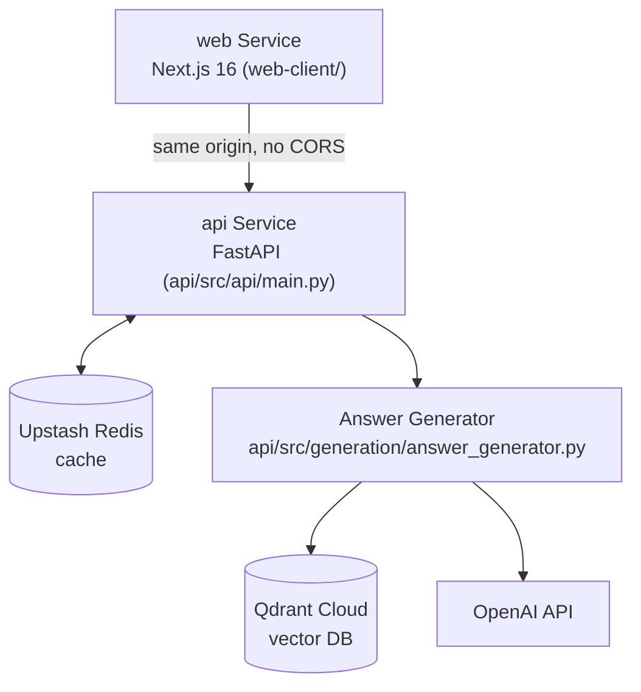

# Care-Beacon Developer Guide

Complete setup and development guide for the Care-Beacon Medical RAG System.

## Table of Contents

- [Prerequisites](#prerequisites)
- [Quick Start](#quick-start)
- [Development Setup](#development-setup)
- [Running the Application](#running-the-application)
- [Testing](#testing)
- [Development Workflow](#development-workflow)
- [Architecture](#architecture)
- [Configuration](#configuration)
- [Troubleshooting](#troubleshooting)
- [Contributing](#contributing)

---

## Prerequisites

Docker, Docker Compose, and a locally-run Redis server are **no longer part of this project**. `render.yaml`, both Dockerfiles, `docker-compose.yml`, and tunnel scripts (ngrok/cloudflared) have all been deleted. The cache is Upstash Redis via the Vercel Marketplace, and local development runs both Vercel Services together with `vercel dev`.

### Required Software

| Software | Version | Purpose |
|----------|---------|---------|
| **Python** | 3.10.19 (local conda env) | Local dev/test runtime — Vercel's `api` service itself runs Python 3.12 |
| **Conda** | Latest | Python environment management (`care-beacon` env, see `setup.sh`) |
| **Vercel CLI** | Latest | `vercel dev` runs both Services locally; also used to deploy |
| **Node.js** | 18+ | Required for `web-client/` (Next.js 16) |

There is no local Redis or vector DB to install — both are managed cloud services (Upstash Redis, Qdrant Cloud) reachable via credentials in `.env`.

### API Keys / Environment Variables

At minimum you need:

- **`OPENAI_API_KEY`** — embeddings and LLM generation (required)
- **`QDRANT_URL`** / **`QDRANT_API_KEY`** — Qdrant Cloud collection (required)
- **`REDIS_URL`** — Upstash Redis, `rediss://` scheme, injected by the Vercel Marketplace integration when linked (required for caching/stats)
- **`ADMIN_API_KEY`** — required to call the admin endpoints (`/api/v1/cache/clear`, `/api/v1/stats/reset`)

---

## Quick Start

Local development runs both Vercel Services — `web` (Next.js) and `api` (FastAPI) — behind the same route table:

```bash
# Clone the repository
git clone https://github.com/your-org/care-beacon.git
cd care-beacon

# Copy environment file and fill in your keys
cp .env.example .env

# Run setup script (creates the `care-beacon` conda env, Python 3.10.19)
chmod +x setup.sh
./setup.sh
conda activate care-beacon

# Start both services via the Vercel route table
vercel dev
```

Everything is served from one origin (as it is in production) — the exact local port is whatever `vercel dev` assigns; there is no separate `docker-compose up` step and no standalone Redis server to start.

---

## Development Setup

### 1. Environment Setup

**Create Conda Environment** (matches the Makefile's `PY` path and CI's expectations):
```bash
# Create environment with the pinned local Python version
conda create -n care-beacon python=3.10.19 -y

# Activate environment
conda activate care-beacon

# Verify Python version
python --version
# Output: Python 3.10.19
```

**Why Python 3.10.19 locally, but 3.12 on Vercel?** The 3.10.19 pin predates this migration and originally existed for ChromaDB compatibility, which no longer applies now that ChromaDB has been removed. The local conda environment has not been repinned since. Vercel's `api` service runs Python 3.12 regardless of what's used locally — the two are independent, and code needs to work under both. A bare `pytest` on a machine with multiple Python installs (e.g. Anaconda base + this env) can silently resolve to the wrong interpreter; always use the full path, `/opt/anaconda3/envs/care-beacon/bin/python`, as the Makefile does.

### 2. Install Dependencies

```bash
cd api

# Runtime dependencies only (exactly what ships to Vercel — 8 packages)
python -m pip install -r requirements.txt

# + development, test, evaluation, and ingestion dependencies (never shipped to Vercel)
python -m pip install -r requirements-dev.txt
```

### 3. Configure Environment Variables

```bash
# Copy example environment file (repo root)
cp .env.example .env
```

Fill in `OPENAI_API_KEY`, `QDRANT_URL`, `QDRANT_API_KEY`, and — if you want caching locally — `REDIS_URL` pointing at an Upstash Redis instance (or link one via `vercel env pull` if the project is linked). There is no local Redis server and no `REDIS_HOST`/`REDIS_PORT` pair to configure; the client expects a single `rediss://` connection string.

### 4. Data

There is no local vector DB or cache directory to initialize — both live in Qdrant Cloud and Upstash Redis. To populate Qdrant with content, see "Ingestion" below; there is nothing else to set up first.

---

## Running the Application

### Development Mode

Run both Vercel Services together:
```bash
conda activate care-beacon
vercel dev
```

This serves `web-client/` and the FastAPI `api/` service behind the same route table defined in `vercel.json`, matching production. There is no separate step to start Redis or a vector database — both are remote managed services reached via the credentials in `.env`.

If you need to run just the FastAPI app directly (bypassing `vercel dev`), it's the standard ASGI app at `api/src/api/main.py`:
```bash
cd api
uvicorn src.api.main:app --reload
```

### Ingestion (local only)

```bash
make ingest   # runs `cd api && python scripts/ingest.py`
```

This is the only way to add or update content in Qdrant Cloud. There used to be an on-demand ingestion API endpoint; it was deleted because spawning a subprocess is impossible on Vercel's serverless functions.

---

## Testing

See `docs/TESTING.md` for the full picture; this is the short version.

### Running Tests

Always run pytest via the pinned interpreter, from `api/`. A bare `pytest` command can resolve to the Anaconda base environment instead of `care-beacon` and fail outright.

```bash
# Full suite
cd api && /opt/anaconda3/envs/care-beacon/bin/python -m pytest tests/ -q --continue-on-collection-errors

# With coverage report
cd api && /opt/anaconda3/envs/care-beacon/bin/python -m pytest tests/ --cov=src --cov-report=term-missing

# Specific file
cd api && /opt/anaconda3/envs/care-beacon/bin/python -m pytest tests/test_api.py -v

# By keyword
cd api && /opt/anaconda3/envs/care-beacon/bin/python -m pytest tests/ -k "test_ask"
```

`make test` and `make test-cov` wrap the same command using the Makefile's `PY` variable.

### Current Test Status

**The suite is not fully green, and never has been.** Current baseline: **6 failed, 239 passed, 0 errors**. The 6 failures are pre-existing and unrelated to the Vercel migration. Do not report the suite as passing, and do not cite older figures (e.g. "100% coverage" or "284 tests passing") — both are stale and false. If you fix or investigate one of the 6 failures, update this baseline (and `docs/TESTING.md`) rather than assuming it's still accurate.

### Writing Tests

**Test Structure**:
```python
"""tests/test_my_feature.py"""
import pytest
from unittest.mock import Mock, patch

@pytest.fixture
def mock_component():
    """Create a mock component for testing."""
    component = Mock()
    component.method.return_value = "expected_value"
    return component

def test_feature_success(mock_component):
    """Test feature works correctly."""
    # Arrange
    input_data = {"key": "value"}

    # Act
    result = my_function(input_data, mock_component)

    # Assert
    assert result == "expected_value"
    mock_component.method.assert_called_once()

def test_feature_error_handling():
    """Test feature handles errors correctly."""
    with pytest.raises(ValueError) as exc_info:
        my_function(invalid_input)

    assert "error message" in str(exc_info.value)
```

**Run New Tests** (from `api/`, with the pinned interpreter):
```bash
cd api && /opt/anaconda3/envs/care-beacon/bin/python -m pytest tests/test_my_feature.py -v
```

---

## Development Workflow

### 1. Branch Strategy

```bash
# Create feature branch
git checkout -b feature/my-feature

# Make changes
git add .
git commit -m "Add my feature"

# Push to remote
git push origin feature/my-feature

# Create pull request on GitHub
```

### 2. Code Style

We use **Black** for formatting and **flake8** + **mypy** for linting/type-checking (see `api/requirements-dev.txt` and the Makefile's `lint`/`format` targets):

```bash
cd api

# Format code
black src/ tests/

# Check formatting without changes
black --check src/ tests/

# Lint and type-check
flake8 src/ tests/
mypy src/
```

Or via the Makefile from the repo root: `make format`, `make format-check`, `make lint`.

There is no pre-commit configuration in this repository — this section previously described a `.pre-commit-config.yaml` and Ruff setup that don't exist here.

### 3. Commit Messages

Follow conventional commits format:

```bash
# Feature
git commit -m "feat: add source filtering to API"

# Bug fix
git commit -m "fix: resolve cache invalidation issue"

# Documentation
git commit -m "docs: update API documentation"

# Tests
git commit -m "test: add tests for retrieval engine"

# Refactor
git commit -m "refactor: modernize to Pydantic v2"
```

### 4. Pull Request Process

1. **Create branch** from `main`
2. **Make changes** with tests
3. **Run tests** locally: `cd api && /opt/anaconda3/envs/care-beacon/bin/python -m pytest tests/ -q --continue-on-collection-errors` — confirm you haven't moved the 6-failed/239-passed baseline
4. **Format code**: `make format` (or `cd api && black src/ tests/`)
5. **Create PR** with clear description
6. **Address review** comments
7. **Merge** after approval

---

## Architecture

See `docs/ARCHITECTURE.md` for the full picture; this is the condensed version relevant to day-to-day development.

### High-Level Overview



### Component Responsibilities

| Component | Responsibility | Files |
|-----------|---------------|-------|
| **API Layer** | HTTP endpoints, request validation, admin auth | `api/src/api/` |
| **Answer Generator** | Orchestrate RAG pipeline | `api/src/generation/answer_generator.py` |
| **Retrieval Engine** | Search vector database | `api/src/retrieval/retrieval_engine.py` |
| **LLM Client** | Generate answers with citations | `api/src/generation/llm_client.py` |
| **Vector DB** | Store and search embeddings (Qdrant Cloud, the only implementation) | `api/src/storage/qdrant_db.py` (factory: `api/src/storage/vector_db.py`) |
| **Cache Layer** | Cache query results, cost/usage counters | `api/src/caching/redis_cache.py`, `api/src/caching/stats_store.py` |
| **Ingestion** (local-only) | Parse and chunk articles | `api/src/ingestion/`, orchestrated by `api/scripts/ingest.py` |
| **Embeddings** | Generate vector embeddings | `api/src/embeddings/` |

### Request Flow

```
1. User submits question to POST /api/v1/ask
   (Vercel WAF enforces 60 req/60s per IP ahead of this; no CORS check — same origin)
   ↓
2. API validates request (Pydantic)
   ↓
3. Check Upstash Redis cache
   ├─ Cache hit → Return cached result
   ↓
4. Generate query embedding (OpenAI)
   ↓
5. Search vector database (Qdrant Cloud)
   ↓
6. Retrieve top-k relevant paragraphs
   ↓
7. Generate answer with LLM (OpenAI gpt-4o-mini)
   ↓
8. Format response with citations
   ↓
9. Cache result in Redis
   ↓
10. Return to user
```

---

## Configuration

### Config Files

**`api/config/config.yaml`** is the real file — the excerpt below matches it (see the file itself for the full set of options, including retrieval tuning, cost-tracking rates, and medical-safety settings):

```yaml
vector_db:
  provider: "qdrant"  # Qdrant Cloud -- the only supported provider
  collection_name: "care-beacon-medical"
  distance_metric: "cosine"
  # Credentials come from the QDRANT_URL / QDRANT_API_KEY environment variables

llm:
  provider: "openai"
  model: "gpt-4o-mini"
  max_tokens: 1000
  temperature: 0.1

embeddings:
  provider: "openai"
  model: "text-embedding-3-small"
  dimensions: 1536

cache:
  enabled: true
  redis_host: "localhost"   # fallback only -- see below
  redis_port: 6379          # fallback only -- see below
  ttl_seconds: 3600

api:
  host: "0.0.0.0"
  port: 8000
  debug: false
```

There is no `cors_origins` or `rate_limit` block in this config — CORS doesn't apply (same-origin), and rate limiting is a Vercel WAF rule, not something the application reads from config.

### Environment Variables

`api/src/caching/redis_cache.py` checks `REDIS_URL` first, before falling back to the `redis_host`/`redis_port`/`redis_db`/`redis_password` config keys above. In production, Vercel's Upstash Redis Marketplace integration injects `REDIS_URL` (`rediss://` scheme) — the `redis_host`/`redis_port` fallback exists for older/local setups, not for the live deployment.

```bash
export OPENAI_API_KEY=sk-...
export QDRANT_URL=https://xyz.qdrant.io
export QDRANT_API_KEY=...
export REDIS_URL=rediss://...          # takes priority over redis_host/redis_port
export ADMIN_API_KEY=...               # required for the two admin endpoints
```

### Loading Configuration

```python
from src.config_loader import get_config

config = get_config()

llm_model = config.get("llm.model")              # "gpt-4o-mini"
cache_ttl = config.get("cache.ttl_seconds", 3600)

openai_key = config.get_api_key("openai")
```

---

## Troubleshooting

### Common Issues

#### 1. `pytest` runs but behaves unexpectedly, or ModuleNotFoundError

**Problem**: a bare `pytest` (or `python`) resolves to the Anaconda base environment instead of `care-beacon`, silently using the wrong Python (3.10.19 is expected locally).

**Solution**: always use the full interpreter path, as the Makefile does:
```bash
/opt/anaconda3/envs/care-beacon/bin/python --version   # Must show 3.10.19
cd api && /opt/anaconda3/envs/care-beacon/bin/python -m pytest tests/ -q --continue-on-collection-errors
```

#### 2. Redis Connection Error

**Problem**: API can't connect to Redis
```
redis.exceptions.ConnectionError: Error connecting to Redis
```

**Solution**: There is no local Redis server to start — the cache is Upstash Redis via the Vercel Marketplace. Check that `REDIS_URL` is set (`rediss://...`) in `.env`, or pull it from the linked Vercel project:
```bash
vercel env pull
```

#### 3. OpenAI API Key Error

**Problem**: 401 Unauthorized from OpenAI
```
openai.error.AuthenticationError: Invalid API key
```

**Solution**: Check API key configuration
```bash
cat .env | grep OPENAI_API_KEY
```

#### 4. Qdrant connection / health check failing

**Problem**: `/api/health` returns 503, or requests fail to reach Qdrant.

**Solution**: Confirm `QDRANT_URL` and `QDRANT_API_KEY` are set. On the free tier, an idle Qdrant Cloud cluster can be reclaimed — the daily `.github/workflows/keepalive.yml` ping exists specifically to prevent that in production. Locally, check the Qdrant Cloud console directly.

#### 5. Admin endpoint returns 401/403

**Problem**: `POST /api/v1/cache/clear` or `POST /api/v1/stats/reset` rejects the request.

**Solution**: Both require an `X-API-Key` header matching the `ADMIN_API_KEY` environment variable.

### Debug Mode

```bash
export LOG_LEVEL=DEBUG
```

or in `api/config/config.yaml`:
```yaml
logging:
  level: "DEBUG"
```

### Health Checks

```bash
# Check API health (note the /api prefix -- plain /health no longer exists)
curl https://care-beacon-health.vercel.app/api/health

# Locally, via vercel dev
curl http://localhost:3000/api/health   # exact local port depends on what vercel dev assigns

# Check vector DB stats through the API rather than a direct DB file inspection --
# there is no local Chroma/SQLite file anymore
curl https://care-beacon-health.vercel.app/api/v1/vector-db/stats
```

---

## Contributing

### Getting Started

1. **Fork the repository** on GitHub
2. **Clone your fork**:
   ```bash
   git clone https://github.com/your-username/care-beacon.git
   cd care-beacon
   ```
3. **Set up development environment** (see above)
4. **Create feature branch**:
   ```bash
   git checkout -b feature/my-feature
   ```

### Development Guidelines

1. **Write tests** for new features
2. **Don't regress the test baseline** — the suite is not fully green (6 failed, 239 passed, 0 errors as of this writing); don't introduce new failures, and don't claim "100% coverage" anywhere in code or docs
3. **Follow code style** - Black for formatting, flake8 + mypy for linting/type-checking
4. **Update documentation** - Keep docs in sync with code
5. **Add type hints** - Use Python type annotations
6. **Write docstrings** - Document all public functions/classes

### Code Review Checklist

- [ ] Tests added and passing; existing baseline (6 failed, 239 passed) not made worse
- [ ] Code formatted with Black
- [ ] Linting passes (flake8, mypy)
- [ ] Documentation updated
- [ ] Type hints added
- [ ] Commit messages follow convention
- [ ] PR description is clear

### Running Quality Checks

```bash
cd api
black src/ tests/
flake8 src/ tests/
mypy src/
/opt/anaconda3/envs/care-beacon/bin/python -m pytest tests/ --cov=src --cov-report=term-missing

# Or, from the repo root:
make format lint test
```

---

## Additional Resources

- **Architecture**: [docs/ARCHITECTURE.md](./ARCHITECTURE.md)
- **Testing**: [docs/TESTING.md](./TESTING.md)
- **Qdrant Cloud setup**: [docs/QDRANT_CLOUD_SETUP.md](./QDRANT_CLOUD_SETUP.md)
- **Project reference doc**: [../CLAUDE.md](../CLAUDE.md)
- **API docs (Swagger/ReDoc)**: only served when `api.debug: true` in `api/config/config.yaml` (`docs_url`/`redoc_url` are `None` otherwise) — disabled by default, including in production

---

## Contact & Support

- **Issues**: [GitHub Issues](https://github.com/your-org/care-beacon/issues)

---

**Last Updated**: 2026-08-05
