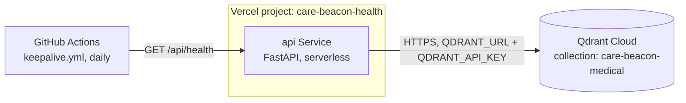

# Qdrant Cloud Setup

**Current state: this migration is done, and there is no way back.** ChromaDB has been fully removed from the codebase — `api/src/storage/vector_db.py` is a factory that only ever constructs a `QdrantVectorDatabase` (`api/src/storage/qdrant_db.py`), and raises `ValueError` for any other provider. This guide originally described migrating from ChromaDB (local, on Render.com's free tier) to Qdrant Cloud; Render.com itself has since been removed too, in favor of Vercel. What follows covers what's still relevant: getting a Qdrant Cloud cluster and wiring its credentials into the current Vercel deployment.

## Why Qdrant Cloud?

- The API service (`api`, on Vercel) makes lightweight HTTP requests to Qdrant rather than holding a vector index in its own process memory — important for a serverless function, which has no persistent local disk to keep an index on anyway.
- Free tier: 1GB storage, unlimited API calls.
- **Free-tier clusters get reclaimed after a period of inactivity.** `.github/workflows/keepalive.yml` runs daily and pings `GET /api/health` (which performs a real Qdrant collection read) specifically to keep the cluster alive. If you see the cluster has been reclaimed, check that this workflow is running and that the `SITE_URL` repository variable it depends on is set.

## Architecture



There is no local vector index shipped with the `api` function bundle, and no ChromaDB fallback.

---

## Step 1: Sign Up for Qdrant Cloud

1. Go to [Qdrant Cloud](https://cloud.qdrant.io)
2. Click "Get Started" or "Sign Up"
3. Create an account (free, no credit card required)
4. Verify your email

## Step 2: Create a Cluster

1. Log into Qdrant Cloud dashboard
2. Click "+ Create Cluster"
3. Configure your cluster:
   - **Name**: `care-beacon-production` (or whatever you like — `api/config/config.yaml` sets the collection name separately, as `care-beacon-medical`)
   - **Tier**: **Free** (1GB storage)
   - **Region**: pick whichever is closest to Vercel's serving region for this project
4. Click "Create"
5. Wait 1-2 minutes for cluster to provision

## Step 3: Get Your Credentials

After cluster is created:

1. Click on your cluster name
2. Find **Cluster URL**:
   - Example: `https://abc123-example.qdrant.io`
   - Copy this URL
3. Click "API Keys" tab
4. Click "+ Create API Key"
5. Give it a name (e.g., "care-beacon-production")
6. Copy the API key (you won't see it again!)

## Step 4: Qdrant Client Dependency

`qdrant-client==1.12.1` is already pinned in `api/requirements.txt` — one of the exactly 8 runtime dependencies shipped to Vercel. There's nothing to install separately unless you're setting up a fresh local environment:

```bash
cd api && python -m pip install -r requirements.txt
```

## Step 5: Configure Environment Variables

The vector DB provider is not configurable via an env var — `api/src/storage/vector_db.py` only ever constructs a Qdrant client (it raises `ValueError` for anything else). You only need to supply credentials.

### Local Development

Edit `.env` at the repo root (or `vercel env pull` if the project is linked):

```bash
QDRANT_URL=https://your-cluster.qdrant.io
QDRANT_API_KEY=your-api-key-here
```

### Vercel (Production)

```bash
vercel env add QDRANT_URL production
vercel env add QDRANT_API_KEY production
```

Or via the Vercel dashboard: Project Settings → Environment Variables. There is no Render dashboard step anymore — Render.com is not part of this deployment.

## Step 6: Populate the Collection

The one-time ChromaDB → Qdrant data migration already happened; there is no `migrate_chromadb_to_qdrant.py` script in this codebase to run again. Going forward, the only way to add or refresh content in a Qdrant Cloud collection is the local ingestion script:

```bash
make ingest   # runs `cd api && python scripts/ingest.py`
```

This is local-only by design — there used to be an on-demand ingestion API endpoint, but it spawned a subprocess, which serverless functions can't do, so it was removed.

## Step 7: Test Qdrant Locally

```bash
conda activate care-beacon
vercel dev
```

Then test a query against the actual endpoint (`POST /api/v1/ask`, not `/api/v1/query`):

```bash
curl -X POST "http://localhost:3000/api/v1/ask" \
  -H "Content-Type: application/json" \
  -d '{"question": "What are the symptoms of breast cancer?"}'
```

You should see an answer with citations. `GET /api/health` (real Qdrant read, 503 if unreachable) and `GET /api/v1/vector-db/stats` are also useful sanity checks.

## Step 8: Deploy

There is no Render.com dashboard step. Deployment is via Vercel:

```bash
git add .
git commit -m "..."
git push origin main    # if the repo is connected to Vercel for auto-deploy
# or:
vercel --prod
```

Verify production with `curl https://care-beacon-health.vercel.app/api/health`.

---

## Troubleshooting

### Error: "QDRANT_URL not configured"

**Solution:**
- Make sure `QDRANT_URL` and `QDRANT_API_KEY` are set in Vercel's environment variables (`vercel env add ...` or the dashboard) and in your local `.env`
- Redeploy if you just added the variables

### Error: "Failed to connect to Qdrant" / `GET /api/health` returns 503

**Solution:**
- Verify your Qdrant cluster is running (check Qdrant Cloud dashboard) — free-tier clusters get reclaimed after inactivity; confirm `.github/workflows/keepalive.yml` has been running (check the Actions tab and that the `SITE_URL` repo variable is set)
- Check that the URL is correct and ends with `.qdrant.io`
- Verify API key is correct (regenerate if needed)

### Error: "Collection not found"

**Solution:**
- Run `make ingest` to (re)populate the collection
- Check Qdrant Cloud dashboard to see if the collection exists
- Collection name should match `vector_db.collection_name` in `api/config/config.yaml` (`care-beacon-medical`)

### Slow Query Performance

**Causes:**
- Network latency between the Vercel function's region and Qdrant's
- Free tier has rate limits

**Solutions:**
- Choose a Qdrant region close to where your Vercel function runs
- Caching (Upstash Redis) is already enabled by default in config
- Consider upgrading to Qdrant's paid tier if needed

---

## Cost Summary

This repository has no record of actual current billing for Qdrant Cloud, Upstash Redis, or Vercel. The free-tier figures below are what Qdrant Cloud publishes; they are not a verified statement of what this project is currently paying.

| Service | Free Tier | Notes |
|---------|-----------|-------|
| Qdrant Cloud | 1GB storage, unlimited API calls | Subject to idle-cluster reclamation — see the keepalive workflow above |
| Qdrant Standard (paid) | ~$25/mo | 4GB storage, better performance, if you outgrow the free tier |

Render.com is no longer part of this deployment, so its pricing tiers are irrelevant here; Vercel's own pricing for the `api`/`web` Services isn't recorded in this repository either.

---

## Next Steps

After successful migration:

1. ✅ Monitor query performance in production
2. ✅ Check Qdrant Cloud dashboard for usage metrics
3. ✅ Set up alerting if needed
4. ✅ Consider upgrading if you exceed free tier limits
5. ✅ Update your documentation to reflect Qdrant setup

**Congratulations!** 🎉 You've successfully migrated to Qdrant Cloud!
