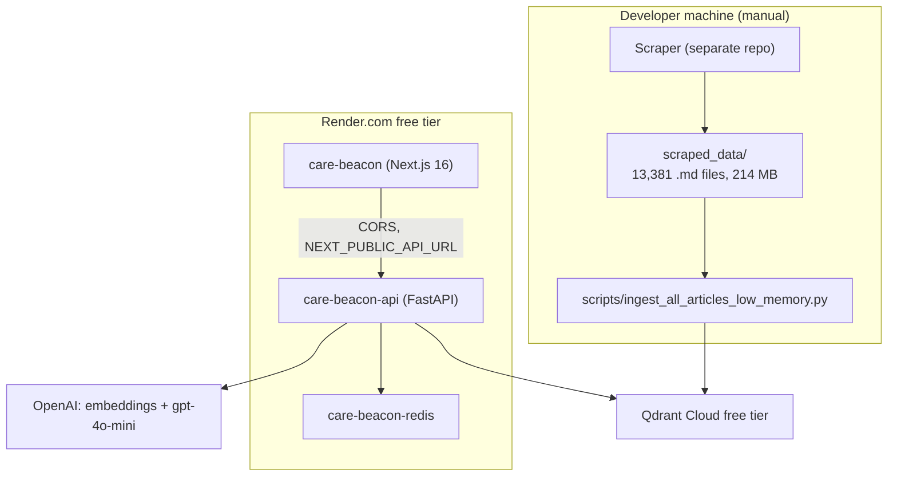
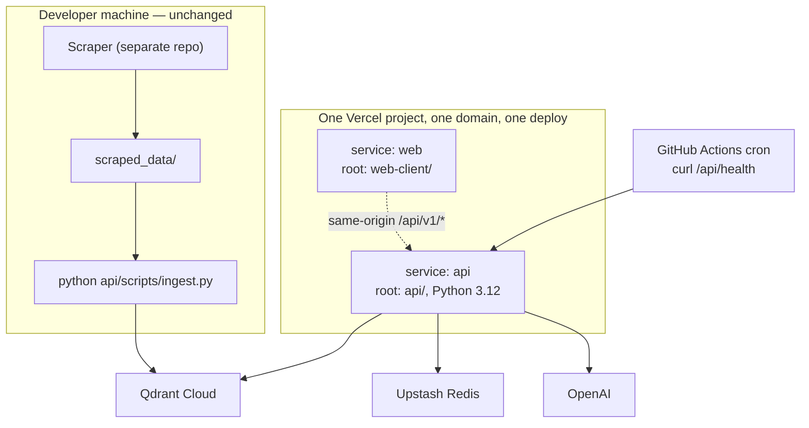

# Care-Beacon: Vercel Migration and Simplification

**Date:** 2026-08-03
**Status:** Approved design, pending implementation plan

## Problem

Care-Beacon runs three services on the Render.com free tier: a FastAPI backend, a
Next.js frontend, and a Redis instance. Render spins the free-tier web services down
when idle, so the first request after a quiet period stalls for tens of seconds. The
vector store is a Qdrant Cloud free-tier cluster, which is reclaimed after roughly a
week without activity.

Two goals follow from this:

1. Move hosting to Vercel, where functions do not spin down the way Render free-tier
   services do.
2. Keep the Qdrant cluster alive with a scheduled request that performs a real read.

A third goal is independent of hosting but blocks the move: the codebase carries
several subsystems that are deployed nowhere, a 272 MB build artifact that cannot fit
a serverless bundle, and a runtime dependency list more than four times larger than the
API actually imports.

## Current system



The `/api/v1/ask` request path: Redis lookup, embed the question, Qdrant search with
6x over-fetch, a second LLM call to re-rank, similarity-threshold filter, gpt-4o-mini
generation, citation extraction, Redis write.

### Findings that drive the design

| Finding | Consequence |
|---|---|
| `requirements.txt` installs langchain, langgraph, ragas, datasets, jupyter, gliner, pandas, and the lint/type toolchain into the API service | Dominates build time and cold-start cost. The API imports 8 packages. |
| `data/bm25_index.pkl` is 272 MB; `ENABLE_HYBRID_SEARCH=false` is set in production because loading it exhausted Render's memory | Cannot ship to a serverless bundle. Hybrid search is already inactive in production. |
| `VectorDatabase` in `src/storage/vector_db.py:15-362` references `chromadb` and `Settings`, neither of which is imported | Dead code. Instantiating it raises `NameError`. |
| `src/graph_api/` (Neo4j) and `mcp/` appear in neither `render.yaml` nor the request path | Undeployed subsystems carrying the `neo4j` and `gliner` dependencies. |
| Rate limiter, performance monitor, LLM cost counters and cache stats are process-global | Already reset on every Render redeploy; on serverless they report per-instance noise. |
| `/api/v1/admin/ingest` spawns a 15-minute subprocess (`src/api/main.py:666-835`) | Structurally impossible on Vercel. |
| CORS is `*`; `/cache/clear` and `/stats/reset` have no authentication | Anyone with the URL can wipe the cache. |

### Platform constraints (verified against Vercel documentation, 2026-08-03)

- **Services** deploy multiple frameworks in one project behind one domain and one
  route table.
- Python runtime supports **3.12, 3.13, 3.14 only**. The project pins 3.10.19, so a
  version move is mandatory regardless of other choices.
- Python function bundles may be 500 MB uncompressed.
- Hobby: 300 s maximum duration, 2 GB memory. Cron on Hobby is limited to once per day
  with up to 59 minutes of jitter; per-minute scheduling requires Pro.

## Decisions

| Decision | Choice | Rationale |
|---|---|---|
| API runtime | Keep Python; deploy frontend and backend as two services in one Vercel project | Preserves the tested Python logic and its pytest suite. Rewriting in TypeScript would not remove Python from the project, because ingestion stays Python. |
| Keepalive | GitHub Actions scheduled workflow | Free, any frequency, works on Vercel Hobby, survives the Vercel project being paused, and leaves a visible run history. |
| Cache | Upstash Redis via Vercel Marketplace | `src/caching/redis_cache.py` works unchanged against a different connection string. Preserves both the answer cache and the expensive vector-DB stats cache. |
| Hybrid search | Remove | No production behaviour change, since it is already disabled there. Removes the 272 MB artifact and the lazy-load branching. Qdrant-native sparse vectors remain available later as a separate project. |
| Cost/usage statistics | Move counters into Redis | Makes them correct across instances and across redeploys, which they are not today. |
| Admin authentication | Require the existing `X-API-Key`, plus Vercel Deployment Protection on the Admin route | No secret in browser storage, no new UI. |
| Undeployed subsystems, admin ingest, in-process telemetry, Docker/Render/tunnel scaffolding | Remove | Each is either dead or incompatible with serverless. |

## Target architecture



### Routing

A single `vercel.json` at the repository root:

```json
{
  "services": {
    "web": { "root": "web-client/" },
    "api": { "root": "api/", "entrypoint": "src.api.main:app" }
  },
  "rewrites": [
    { "source": "/api/(.*)", "destination": { "service": "api" } },
    { "source": "/(.*)",     "destination": { "service": "web" } }
  ]
}
```

Sharing an origin removes three things at once, each of which existed only because the
halves lived at different addresses:

- the CORS middleware and its `allow_origins: ["*"]`
- the `NEXT_PUBLIC_API_URL` environment variable, and every tunnel script that fed it
- the `rewrites` block in `web-client/next.config.js`

The frontend change is one line: `API_BASE_URL` in `web-client/lib/api.ts:10` becomes
the empty string. `getHealth()` moves from `/health` to `/api/health` so that the
single `/api/(.*)` rewrite covers every backend call.

### Repository layout

Vercel Services builds each service from its own `root` directory, so all Python must
live under one folder. Configuration is read by relative path
(`Path("config/prompts.yaml")` in `src/generation/answer_generator.py:82`), so it moves
with the code.

| From | To |
|---|---|
| `src/` | `api/src/` |
| `config/config.yaml`, `config/prompts.yaml` | `api/config/` |
| `tests/` | `api/tests/` |
| `scripts/ingest_all_articles_low_memory.py` | `api/scripts/ingest.py` |
| `requirements.txt` | `api/requirements.txt` and `api/requirements-dev.txt` |

`scraped_data/` (214 MB) and `data/` remain at the repository root, which places them
outside `api/`. They are therefore excluded from the function bundle by construction
rather than by an `excludeFiles` glob.

`.python-version` changes from `3.10.19` to `3.12`. `runtime.txt` is deleted. Every
runtime dependency — `qdrant-client`, `openai`, `fastapi`, `pydantic`, `redis`,
`pyyaml`, `loguru`, `python-dotenv` — supports 3.12.

## Removals

| Removed | Scale |
|---|---|
| `src/graph_api/`, `mcp/`, `Dockerfile.graph`, `Dockerfile.mcp`, `requirements-mcp.txt`, `scripts/ingest_graph.py`, and the `neo4j` and `gliner` dependencies | 1,069 lines |
| `/api/v1/admin/ingest`, `/api/v1/admin/ingest/stream` (`src/api/main.py:666-835`), `web-client/components/ingestion-control.tsx` | ~490 lines |
| `src/api/performance.py`, the four `/api/v1/performance*` endpoints, the performance middleware, the `_rate_limit_cache` limiter | ~450 lines |
| `Dockerfile`, `docker-compose.yml`, `render.yaml`, `scripts/render_build.sh`, `start-ngrok*.sh`, `start-cloudflared-tunnels.sh`, `ngrok.yml`, and the Render, ngrok and Docker documents | ~15 files |
| Dead `VectorDatabase` class, `src/storage/vector_db.py:15-362` | ~350 lines |
| `src/storage/bm25_index.py`, `data/bm25_index.pkl`, the `rank-bm25` dependency, the hybrid-search configuration block, the lazy-load branching in `qdrant_db.py` | 207 lines and 272 MB |

`src/storage/vector_db.py` reduces from 396 lines to approximately 30: the
`create_vector_database()` factory alone.

## Dependencies

Tracing the import graph from `src/api/main.py` gives eight runtime packages, against
the 36 that `requirements.txt` installs today:

```
fastapi  pydantic  openai  qdrant-client  redis  pyyaml  loguru  python-dotenv
```

Verified unused on the API path: `numpy`, `pandas`, `tqdm`, `psutil`, `markdown`,
`pydantic-settings`, and `uvicorn` (Vercel supplies the ASGI server). `anthropic` is
never imported — `src/generation/llm_client.py:61-63` raises `NotImplementedError` for
that provider. `python-frontmatter` is reached only through
`src/ingestion/markdown_parser.py`, which the API never imports.

`api/requirements-dev.txt` receives `python-frontmatter`, `langchain`, `langgraph`,
`ragas`, `datasets`, `jupyter`, `black`, `flake8`, `mypy`, and the pytest packages.

## Behaviour changes

**Cost counters move to Redis.** `LLMClient`, `EmbeddingGenerator` and `CacheStats`
hold `total_cost`, `total_tokens` and `call_count` as instance attributes. These become
`INCRBYFLOAT` and `INCR` operations against Upstash keys under `care_beacon:stats:*`,
read back by `/api/v1/stats`. The figures stop resetting on redeploy, which they do
today.

**Rate limiting moves to the Vercel WAF**, configured in the dashboard rather than in
code.

**Admin endpoints require authentication.** The existing `require_admin_api_key`
dependency (`src/api/main.py:60-76`) is applied to `/api/v1/cache/clear` and
`/api/v1/stats/reset`. The Admin route sits behind Vercel Deployment Protection, so the
browser holds no secret.

**`/api/health` performs a real Qdrant read** via `client.get_collection()`. A 200
therefore proves the cluster is reachable, not merely that the function booted. This is
what makes it a valid keepalive target.

**Ingestion becomes local-only:** `python api/scripts/ingest.py`, which is how it is
already run.

## Keepalive

`.github/workflows/keepalive.yml` runs `cron: "0 9 * * *"` and issues one
`curl --fail` against `/api/health`. Failures surface as a red run in the Actions tab.

GitHub disables scheduled workflows in a repository with no commits for 60 days. The
workflow therefore also declares `workflow_dispatch` for manual firing, and the README
records the 60-day rule.

## Unchanged

The RAG pipeline itself: chunking, the LLM re-ranker, the `min_similarity: 0.6`
threshold tuned against re-ranked scores, the prompt templates, and citation
formatting. These were tuned over several commits and are orthogonal to hosting.

## Verification

The pytest suite is the safety net for a change of this breadth. Tests covering deleted
modules — `test_performance.py`, `test_hybrid_search.py`, and the `test_vector_db.py`
cases exercising the dead Chroma class — are removed; the remainder must stay green.

Before production is touched:

1. `vercel dev` locally, to prove same-origin routing.
2. A preview deployment, to prove the real build.
3. A known-good question asked against preview, with citations compared against what
   production returns today.

## Risks

**Path rewriting through Services is unverified by execution.** The documentation
describes controlling the path a service sees, but it is not established whether
`/api/v1/ask` reaches FastAPI intact or stripped to `/v1/ask`. The design assumes it is
preserved. If it is stripped, the remedy is a `basePath` setting or a shift in the
FastAPI route prefixes. This must be settled as the first implementation step rather
than assumed.

**Cold start is unmeasured for this deployment.** There is no Render-style spin-down,
but a Python function initialises the OpenAI and Qdrant clients on first request.
Expect low single-digit seconds. The dependency reduction from 36 packages to eight is
the primary lever available.
